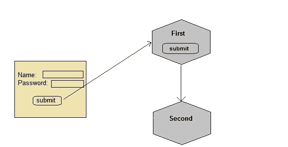

# 在 Servlet 中将隐藏表单字段用于会话管理

> 原文：<https://www.studytonight.com/servlet/hidden-form-field.php>

隐藏的表单字段也可用于存储特定客户端的会话信息。在隐藏表单字段的情况下，隐藏字段用于存储客户端状态。在这种情况下，用户信息存储在隐藏字段值中，并从另一个 servlet 中检索。

* * *

### 使用隐藏表单域进行会话管理的优势

*   cookie 是否被禁用并不取决于浏览器。
*   需要插入隐藏类型的简单 HTML 输入字段。因此，它更容易实现。

* * *

### 使用隐藏表单字段进行会话管理的缺点

*   每一页都需要额外的表格提交。这是很大的开销。

* * *

### 演示会话隐藏表单字段用法的示例



以下提到的文件是示例所必需的:

**index.html**

```java
<form method="post" action="validate">
  Name:<input type="text" name="user" /><br/>
  Password:<input type="text" name="pass" ><br/>
  <input type="submit" value="submit">
</form> 
```

**web.xml**

```java
<web-app...>

    <servlet>
        <servlet-name>First</servlet-name>
        <servlet-class>First</servlet-class>
    </servlet> 
    <servlet-mapping>
        <servlet-name>First</servlet-name>
        <url-pattern>/First</url-pattern>
    </servlet-mapping>

    <servlet>
        <servlet-name>Second</servlet-name>
        <servlet-class>Second</servlet-class>
    </servlet>
    <servlet-mapping>
        <servlet-name>Second</servlet-name>
        <url-pattern>/Second</url-pattern>
    </servlet-mapping>

    <welcome-file-list>
        <welcome-file>index.html</welcome-file>
    </welcome-file-list>

</web-app> 
```

**First.java**

```java
import java.io.*;
import javax.servlet.*;
import javax.servlet.http.*;

public class First extends HttpServlet {

  protected void doPost(HttpServletRequest request, HttpServletResponse response)
            throws ServletException, IOException {
        response.setContentType("text/html;charset=UTF-8");
        PrintWriter out = response.getWriter();

	//getting value submitted in form from HTML file
        String user = request.getParameter("user");

        //creating a new hidden form field
        out.println("<form action='Second'>");
        out.println("<input type='hidden' name='user' value='"+user+"'>");
        out.println("<input type='submit' value='submit' >");
        out.println("</form>");
    }
} 
```

**Second.java**

```java
 import java.io.*;
import javax.servlet.*;
import javax.servlet.http.*;

public class Second extends HttpServlet {

  protected void doGet(HttpServletRequest request, HttpServletResponse response)
            throws ServletException, IOException {
        response.setContentType("text/html;charset=UTF-8");
        PrintWriter out = response.getWriter();

        //getting parameter from the hidden field
        String user = request.getParameter("user");
        out.println("Welcome "+user);
    }
} 
```

就像我们在**第一个** Servlet 中创建了一个隐藏字段，填充了用户的值，并发送给了**第二个** Servlet，现在第二个 Servlet 也有了用户信息。同样，我们将不得不使用隐藏字段在任何需要的地方发送这些信息。

* * *

* * *