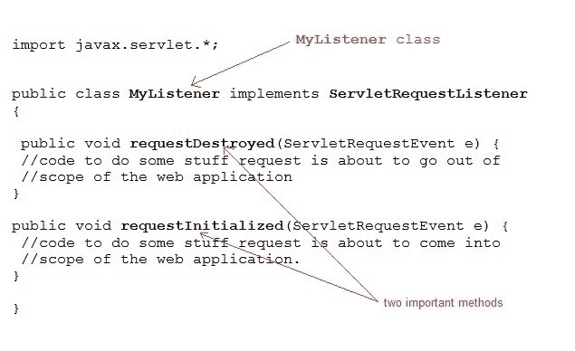

# Servlet 中的 ServletRequestEvent 和 ServletRequestListener

> 原文：<https://www.studytonight.com/servlet/servlet-request-event-and-listener.php>

**ServletRequestEvent** 类为 **ServletRequest** 提供生命周期事件的通知。事件的来源是网络应用的 ServletContext。 **ServletRequestListener** 接收 ServletRequestEvent 生成的通知，并根据这些通知执行一些指定的任务。

* * *

## ServletRequestListener 的几个重要方法

| 方法 | 描述 |
| 作废`requestDestroyed(ServletRequestEvent e)` | 当请求即将超出 web 应用的范围时调用.. |
| 作废`requestInitialized(ServletRequestEvent e)` | 当请求即将进入 web 应用的范围时调用。 |

* * *

### ServletRequestListener 示例

因此，可以很容易地实现 ServletRequestListener 接口，并为它提供的两个方法`requestDestroyed()`和`requestInitialized()`提供定义。

顾名思义，这些方法将在请求被初始化和销毁时被调用，因此我们可以将它们用于各种目的，比如当请求被销毁时**变量清理**，或者当请求被接收时执行一些**初始检查**等等。

* * *

* * *