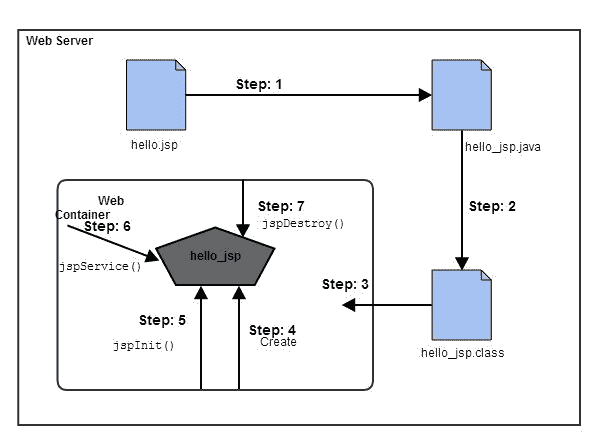

# JSP 的生命周期

> 原文：<https://www.studytonight.com/jsp/lifecycle-of-jsp.php>

为了服务请求，一个 JSP 页面被转换成 Servlet。JSP 页面到 Servlet 的转换称为 JSP 的生命周期。JSP 生命周期与 Servlet 生命周期完全相同，只是多了一个第一步，即将 JSP 代码翻译成 Servlet 代码。以下是 JSP 生命周期步骤:

1.  JSP 到 Servlet 代码的翻译。
2.  将 Servlet 编译成字节码。
3.  正在加载 Servlet 类。
4.  正在创建 servlet 实例。
5.  通过调用`jspInit()`方法初始化
6.  通过调用`_jspService()`方法进行请求处理
7.  调用`jspDestroy()`方法销毁



**Web 容器**将 JSP 代码翻译成一个 **servlet 类源(。java)文件**，然后将其编译成 java servlet 类。第三步，使用 classloader 加载 servlet 类字节码。容器然后创建该 servlet 类的一个实例。

 *初始化的 servlet 现在可以服务请求。对于每个请求，**网络容器**调用 **_jspService()** 方法。当容器从服务中移除 servlet 实例时，它调用**jspdestory()**方法来执行任何需要的清理。

* * *

#### 当 JSP 被翻译成 Servlet 时会发生什么

让我们看看当 JSP 代码被翻译成 Servlet 时会发生什么。里面写的代码是 JSP 代码。

```java
<html>
    <head>
        <title>My First JSP Page</title>
    </head>
    <%
       int count = 0;
    %>
    <body>
        Page Count is:  
        <% out.println(++count); %>
    </body>
</html>
```

上面的 JSP 页面(hello.jsp)变成了这个 Servlet，

```java
public class hello_jsp extends HttpServlet
{
  public void _jspService(*HttpServletRequest* request, *HttpServletResponse* response) 
                               throws IOException,ServletException
   {
      PrintWriter out = response.getWriter();
      response.setContenType("text/html");
      out.write("<html><body>");
      int count=0;
      out.write("Page count is:");
      out.print(++count);
      out.write("</body></html>");

   }
} 
```

这只是为了解释，内部发生了什么。作为一名 JSP 开发人员，您不必担心 JSP 页面如何转换成 Servlet，因为它是由 web 容器自动完成的。

* * *

* * **