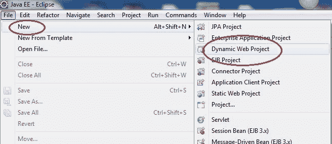
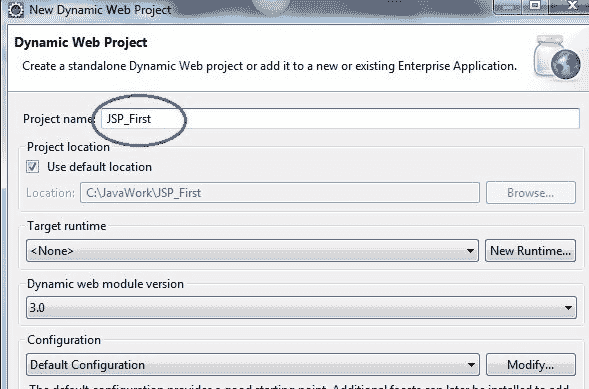
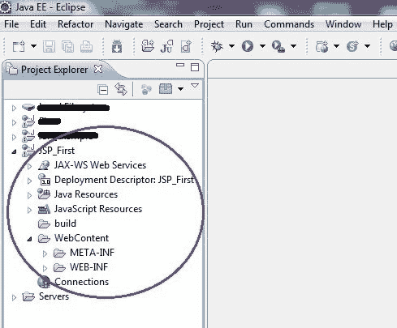
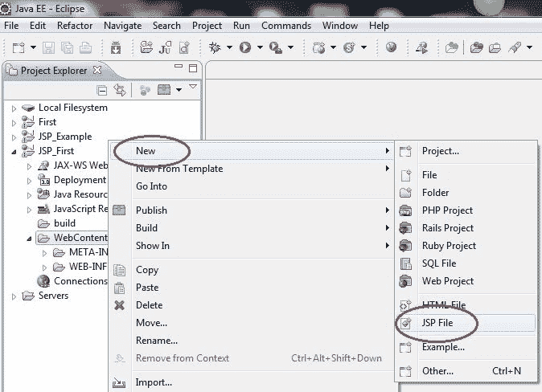
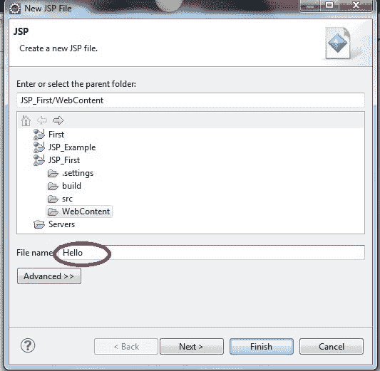
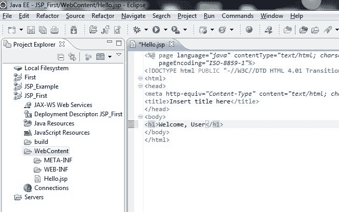
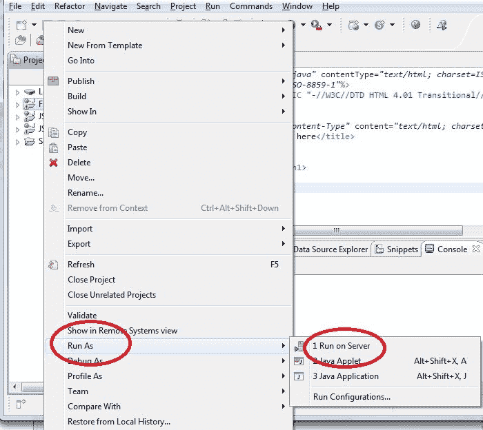
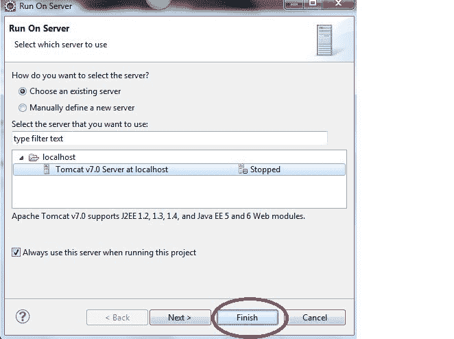
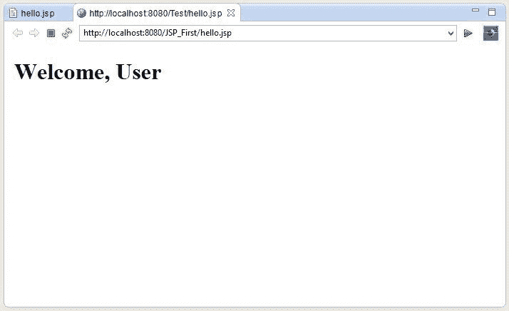

# 创建一个 JSP 页面

> 原文：<https://www.studytonight.com/jsp/creating-a-jsp-page.php>

一个 JSP 页面看起来类似于一个 [HTML 页面](/code/html/)，但是一个 JSP 页面也有 Java 代码在里面。我们可以使用以 `and ends with `%>`开头的**脚本标签**将任何常规的 Java 代码放入 JSP 文件中。JSP 页面用于开发动态响应。`

学习 HTML，去 [HTML 互动课程](/code/html)边学习 HTML 边并排练习。

* * *

## 在 Eclipse 中创建 JSP 页面的示例

*   打开 Eclipse，点击**新建→动态网页项目**

* * *

*   为您的项目命名，然后单击“确定”

* * *

*   您将看到在项目资源管理器中创建了一个新项目

 ** * *

*   要创建新的 JSP 文件，右键单击网页内容目录，**新建→ JSP 文件**

* * *

*   为您的 JSP 文件命名，然后单击“完成”。

* * *

*   在你的 JSP 文件中写一些东西。完整的 HTML 和 JSP 代码放在`<body>`标签里面，就像 HTML 页面一样。

* * *

*   要运行您的项目，右键单击**项目**，选择**运行方式→在服务器上运行**

* * *

*   要启动服务器，请选择现有服务器名称，然后单击“完成”

* * *

*   在浏览器中查看输出。

* 

 ** * *

* * **