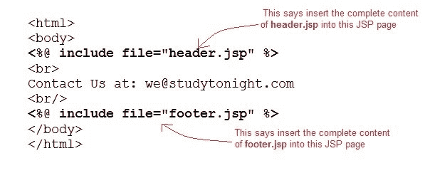
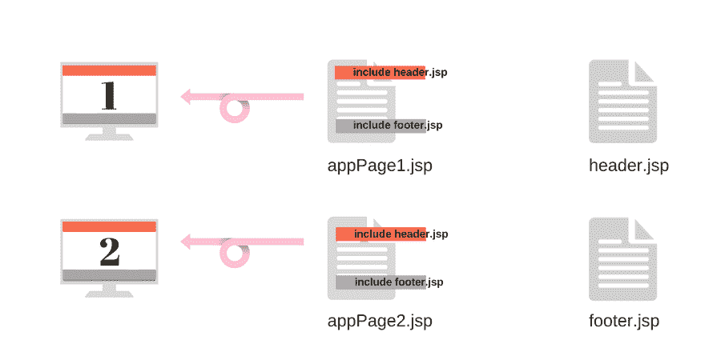
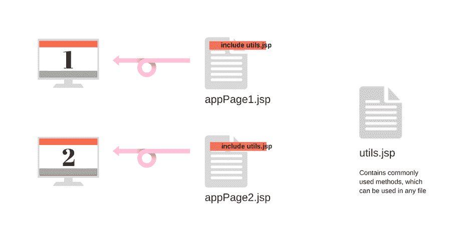

# JSP 包含指令

> 原文：<https://www.studytonight.com/jsp/jsp-include-directive.php>

*include* 指令告诉 Web 容器复制包含文件中的所有内容，并将其粘贴到当前的 JSP 文件中。**包含**指令的语法是:

```java
<%@ include file="filename.jsp" %> 
```



* * *

### 包含指令的示例

**welcome.jsp**

```java
<html>
    <head>
        <title>Welcome Page</title>
    </head>

  <body>
        **Welcome, User
  </body>
</html>** 
```

 ****header.jsp**

```java
 <html>
  <body>
        
  </body>
</html> 
```

 *上面的例子展示了一个非常标准的实践。每当我们构建一个网页应用，所有的网页都有相同的顶部导航栏和底部页脚。我们将它们作为单独的 jsp 文件，并在所有页面中使用`include`指令包含它们。因此，每当我们必须更新顶部导航栏或页脚中的内容时，我们只需在一个地方完成即可。很方便，不是吗？



`include`指令的另一个标准应用是，如果你创建一个单独的 jsp 文件，带有一些常用的函数，有点像 util jsp 文件。它可以包含在网页中任何你想使用这些功能的地方。



类似地，有许多方法可以证明这个指令在给 web 应用代码提供结构方面非常有用。

* * *

* * ****