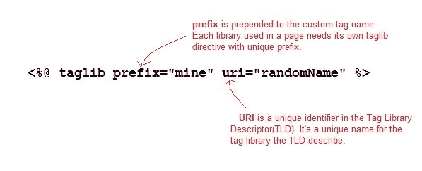

# JSP Taglib 指令

> 原文：<https://www.studytonight.com/jsp/jsp-taglib-directive.php>

taglib 指令用于定义当前 JSP 页面使用的标签库。一个 JSP 页面可能包含几个标签库。JavaServer Pages 标准标签库(JSTL)，是一个有用的 JSP 标签的集合，它提供了许多常用的核心功能。它支持许多一般的结构化任务，例如迭代和条件、用于操作 XML 文档的现成标记、国际化标记以及执行 SQL 操作。taglib 指令的语法是:

```java
<%@ taglib prefix="prefixOfTag" uri="uriOfTagLibrary" %> 
```

前缀用于将自定义标记与其他库自定义标记区分开来。前缀加在自定义标记名称的前面。每个自定义标记都必须有前缀。

URI 是标签库的唯一名称。



你可以给前缀起任何名字，但它应该是唯一的。

* * *

### JSP:使用 Taglib 指令

要在你的应用程序中使用 JSTL，你必须在你的网络应用程序`/WEB-INF/lib`目录中有`jstl.jar`。从[阿帕奇标准 Taglib](http://tomcat.apache.org/taglibs/index.html) 页面下载 jar 文件。

有许多现成的 JST 库可供您使用，让您的生活更加轻松。以下是对不同组的 JST 库的广泛划分:

1.  核心标签-URI→http://java.sun.com/jsp/jstl/core
2.  格式化标签-URI→http://java.sun.com/jsp/jstl/fmt
3.  SQL 标记 uri→http://Java . sun . com/JSP/jstl/SQL
4.  XML 标签-URI→http://java.sun.com/jsp/jstl/xml
5.  JSTL 函数-URI→http://java.sun.com/jsp/jstl/functions

可以在这里查看完整的 JST 库: [Apache 标准 Taglib API](http://tomcat.apache.org/taglibs/standard/apidocs/</p>)

* * *

* * *