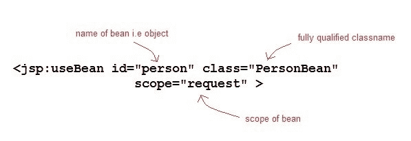

# JSP `jsp:useBean`标签

> 原文：<https://www.studytonight.com/jsp/usebean-tag.php>

如果你想在 JSP 页面中使用 Action 标签与一个 [JavaBeans](javabeans-component.php) 组件交互，你必须首先声明一个 bean。`<jsp:useBean>`是声明和初始化实际 bean 对象的一种方式。我们所说的 **bean** 是指 JavaBean 组件对象。 **< jsp 的语法:useBean >** 标签

```java
<jsp:useBean id = "beanName" class = "className" 
              scope = "page | request | session | application"> 
```

这里 **id** 属性指定了 bean 的名称。**范围**属性指定存储豆的位置。**类**属性指定完全限定的类名。



给定以下内容的 useBean 声明:

```java
<jsp:useBean id="myBean" class="PersonBean" scope="request" /> 
```

相当于下面的 java 代码，

```java
PersonBean myBean = (PersonBean)request.getAttribute("myBean");
if(myBean == null)
{
   myBean = new PersonBean();
   request.setAttribute("myBean", myBean);
} 
```

如果 **jsp:useBean** 标签与主体一起使用，则主体的内容仅在创建 Bean 时执行。如果 bean 已经存在于命名范围中，则跳过主体。

* * *

### 举个例子

在这个例子中，我们将看到如何使用`<jsp:useBean>`标准标签来声明和初始化 bean 对象。我们将使用 PersonBean 类作为 JavaBean 组件。

**PersonBean.java**

```java
import java.io.Serializable;

public class **PersonBean** implements **Serializable**
{
 private String **name**;

  public *PersonBean*()
   {
    this.name="";
   }
   public void *setName*(String name)
   {
    this.name = name;
   }
   public String *getName*()
   {
    return name;
   }
} 
```

**hello.jsp**

```java
<html>
    <head>
        <title>Welcome Page</title>
    </head>
    <**jsp:useBean** id="person" class="PersonBean" scope="request" />
  <body>
        *//Use the bean here...*  
  </body>
</html> 
```

这里 **jsp:useBean** 在 jsp 页面中声明了一个“人”Bean，可以在那里使用。如何使用它，修改它，我们将在以后的课程中学习。

* * *

* * *