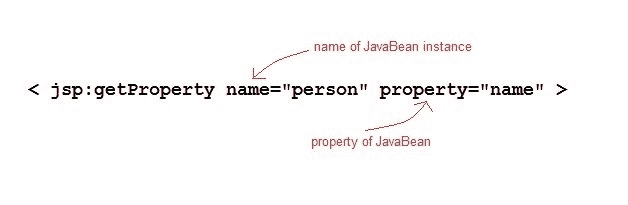

# JSP `jsp:getProperty`标签

> 原文：<https://www.studytonight.com/jsp/getproperty-tag.php>

`getProperty`标记用于从 JavaBeans 实例中检索属性。getProperty 标记的语法如下:

```java
<jsp:getProperty name="beanName" property="propertyName" /> 
```

name 属性表示 JavaBean 实例的名称。property 属性表示我们想要获取其值的 JavaBean 的属性。



* * *

### Java Bean 的`getProperty`示例

下面是我们的 Java 类。

PersonBean.java

```java
import java.io.Serializable;

public class PersonBean implements Serializable
{
  private String name;

  public PersonBean()
  {
    this.name="";
  }
  public void setName(String name)
  {
    this.name = name;
  }
  public String getName()
  {
    return name;
  }
} 
```

hello.jsp

```java
<html>
    <head>
        <title>Welcome Page</title>
    </head>
    <jsp:useBean id="person" class="PersonBean" scope="request" />
  <body>
        Name of Person is : <jsp:getProperty name="person" property="name" />
  </body>
</html> 
```

这将打印属性的值。如果你需要改变财产的价值。让我们在下一课中学习如何设置属性的值。

* * *

* * *