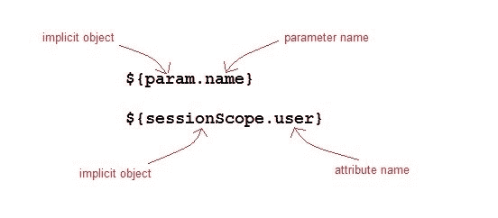

# JSP 表达语言

> 原文：<https://www.studytonight.com/jsp/expression-language.php>

表达式语言被添加到 JSP 2.0 规范中。EL 的目的是产生无脚本的 JSP 页面。JSP 中 EL 的语法如下:

```java
${expr} 
```

这里 expr 是一个有效的 EL 表达式。表达式可以与静态文本/值混合，也可以与其他表达式组合形成更大的表达式。



* * *

## EL 表达式是如何使用的？

在 JSP 页面中，EL 表达式有两种使用方式

1.  As attribute values in standard and custom tags. Example:

    ```java
    <jsp:include page="${location}"> 
    ```

    其中位置变量在 jsp 页面中单独定义。

    表达式也可以用在 [`jsp:setProperty`](setproperty-tag.php) 中来设置一个属性值，使用其他的 bean 属性，比如:如果我们有一个名为 Square 的 bean，它有长度、宽度和面积属性。

    ```java
    <jsp:setProperty name="square" property="area" value="${square.length*square.breadth}" />
    ```

2.  以 HTML 标记输出:

    ```java
    <h1>Welcome ${name}</h1> 
    ```

要停用 EL 表达式的求值，我们指定页面指令的`isELIgnored`属性如下:

```java
<%@ page isELIgnored ="true|false" %>
```

 ** * *

### JSP EL 隐式对象

以下是 EL 中的隐式对象:

| 隐式对象 | 描述 |
| 对象 | 它表示页面上下文对象。 |
| pageScope(页面范围) | 它用于访问在页面范围内设置的任何变量的值 |
| 请求作用域 | 它用于访问在请求范围内设置的任何变量值。 |
| 会话范围 | 它用于访问在会话范围内设置的任何变量值 |
| 应用范围 | 它用于访问在应用范围内设置的任何变量值 |
| 参数 | 将请求参数名称映射到单个值 |
| 参数值 | 将请求参数名称映射到相应的字符串值数组。 |
| 页眉 | 包含标题名称和单个字符串值的映射。 |
| 标题值 | 将包含标题名称的映射到相应的字符串值数组。 |
| 甜饼干 | 包含 cookie 名称和单个字符串值的映射。 |

* * *

### JSP EL 示例

让我们举一个简单的例子来理解 JSP 表达式语言，

**index.jsp**

```java
 <form method="POST" action="welcome.jsp">
    Name <input type="text" name="user" >
    <input type="submit" value="Submit">
</form> 
```

**welcome.jsp**

```java
<html>
    <head>
        <title>Welcome Page</title>
    </head>

  	<body>
        <h1>Welcome ${param.name}</h1>
  	</body>
</html> 
```

* * *

### 电致发光中可用的算术运算

以下是 el 中可用的算术运算符:

| 算术运算 | 操作员 |
| 添加 | `+` |
| 减法 | `-` |
| 增加 | `*` |
| 分开 | `/ and div` |
| 剩余物 | `% and mod` |

* * *

### 逻辑和关系运算符在 EL 中可用

以下是逻辑运算符和`Comparator`在电致发光中的应用:

| 逻辑和关系运算符 | 操作员 |
| 等于 | `== and eq` |
| 不平等 | `!= and ne` |
| 不到 | `< and lt` |
| 大于 | `> and gt` |
| 大于或等于 | `>= and ge` |
| 小于或等于 | `<= and le` |
| 和 | `&& and and` |
| 或者 | `&#124;&#124; and or` |
| 不 | `! and not` |

* * *

* * **