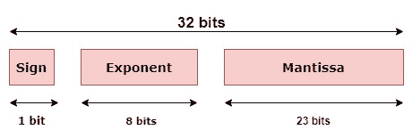
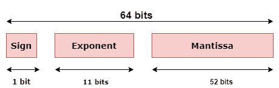

# Java 浮点浮点指针()方法

> 原文：<https://www.studytonight.com/java-wrapper-class/java-float-floattointbits-method>

Java `floatToIntBits()`方法是`java.lang`包的`Float`类的一部分。这是一个静态方法，根据 **IEEE 754** 浮点“单格式”位布局，返回作为参数传递的数字的浮点值。

根据 IEEE 754 浮点表示，32 位和 64 位浮点数可以表示如下:





### 语法:

```java
public static int floatToIntBits(float value) 
```

### 参数:

传递的参数是浮点值，其标准整数位将被返回。

### 返回:

返回作为参数传递的浮点值的标准整数位值。此外，如果参数值分别为正无穷大、负无穷大和 NaN，则会返回整数位值 0x7f800000、0xff800000 和 0x7fc00000。

## 例 1:

这里，取一些随机浮点值，并返回相应的 int 位。

```java
import java.lang.Float;

public class StudyTonight {

	public static void main(String[] args) {

		float n1 = 90.85f;  
		System.out.println(" value in int Bits = "+ Float.floatToIntBits(n1)); //float value converted into int bits 

		float n2 = n1/0.0f;  
		System.out.println(" value in int Bits = "+Float.floatToIntBits(n2));  //float value as positive infinity

		float n3 = -n1/0.0f;  //argument is negative infinity 
		System.out.println(" value in int Bits = "+Float.floatToIntBits(n3));  

	}

} 
```

int Bits 中的值= 1119204147
int Bits 中的值= 2139095040
int Bits 中的值= -8388608

## 例 2:

这里有一个用户定义的例子，任何使用这段代码的人都可以输入自己选择的值，并获得等效的输出。

```java
import java.lang.Float;
import java.util.Scanner;

public class StudyTonight 
{  
    public static void main(String[] args)
    {  
        try
        {
            System.out.println("Enter value");
            Scanner sc = new Scanner(System.in);
            float f = sc.nextFloat();
            System.out.println(" value in int Bits = "+ Float.floatToIntBits(f)); //float value converted into int bits 
        }
        catch(Exception e)
        {
          System.out.println("Invalid Input!!");
        }  
   }  
} 
```

输入值
89.3213
int Bits 中的值= 1119003777
* * * * * * * * * * * * * * * * * * * * * * * * * * * * * * * * * int Bits 中的值
输入值
-45.66
int Bits 中的值=-1036606505
* * * * * * * * * * * * * * * * * * * * * * * * * * * * * *输入值
76x00
无效输入！！

## 实时示例:

在这里，您可以测试实时代码示例。您可以为不同的值执行示例，甚至可以编辑和编写您的示例来测试 Java 代码。

* * *

* * *