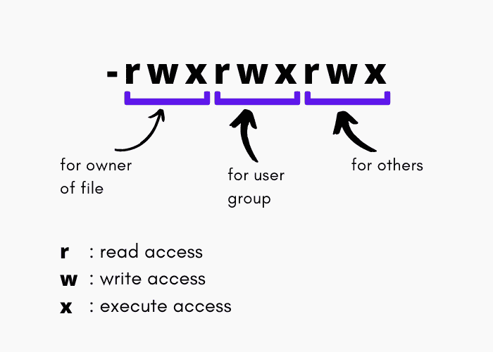

# 理解 Linux（Unix）中的文件权限

> 原文：<https://www.studytonight.com/linux-guide/understanding-file-permissions-in-linux-unix>

在本教程中，我们将向您介绍 Linux 中的**文件权限或访问模式**。每当我们[在 linux 中创建一个文件](https://www.studytonight.com/linux-guide/how-to-create-a-file-in-linux)或[在 linux 中创建一个目录](https://www.studytonight.com/linux-guide/how-to-create-directory-in-linux-mkdir-command)时，一组标志与该文件或目录相关联，表示该特定文件或目录的**权限**或**模式**或**访问模式**。设置权限是为了保护文件和目录。这些权限或访问模式决定了哪个用户可以对文件执行什么操作。

有三种不同类型的用户:

1.  创建文件的文件所有者(*所有者*)。

2.  然后是定义的用户所有权组(*组*)

3.  而其他人(*其他*)

以下是允许用户进行的**操作**或用户获得的**类型的访问**:

*   读取文件内容(**读取**)。

*   将内容写入文件(“**写入**”)。

*   执行文件(“**执行**”)。

这些权限表示为读取的 **r** 、写入的 **w** 和执行的 **x** 。对于所有不同类型的用户来说，这些访问权限都是定义好的，共同构成了文件权限。

## 权限是如何表示的？

当您使用`ls -l`命令列出目录中存在的文件和目录时，您会看到关于文件的信息，如创建它的用户、文件的大小、创建时间和文件权限，例如:

没人没人没人没人没人没人没人没人没人没人没人没人没人没人没人没人没人没人没人没人没人没人没人没人没人

这里，文件权限表示为:

**dr - r - r -** 为 **dir1** ，其中第一个 **d** 表示这是一个目录(如果是**常规文件**开头会是 **-** (破折号)，其余为权限。这里的 r - r - r -是指所有的三类用户，也就是所有者、用户组和其他人都可以直接读取目录的内容。

> 在权限表示中，我们有 **10 个字符**，第一个是表示它是用于常规文件还是目录，接下来的 9 个字符，每个用户类各 3 个，表示权限，其中 **r 代表读取**， **w 代表写入**， **x 代表执行**，用一个**破折号(-)** 代替任何权限意味着**权限没有授予用户类**。

要验证这一点，[通过运行以下命令创建目录](https://www.studytonight.com/linux-guide/how-to-create-directory-in-linux-mkdir-command):

```sh
mkdir -m 444 dir1
```

然后尝试使用触摸命令在该目录内[创建一个新文件](https://www.studytonight.com/linux-guide/how-to-create-a-file-in-linux):

```sh
touch dir1/text.txt
```

您将获得以下输出:

触摸:不能触摸 dir1/text.txt:权限被拒绝

同样，权限 **rwxrwxr-x** 表示目录的**所有者**拥有权限 **rwx** (读、写、执行)，用户组拥有权限 **rwx** (读、写、执行)，其他人拥有权限 **r-x** (读、执行)。



权限表示中的**破折号** (-)表示特定权限未授予用户类。

| 标志 | 意义 |
| --- | --- |
| 读写执行 | 意味着所有的权限-读、写和执行都被授予用户类。 |
| 读和执行 | 意味着用户可以读取和执行文件/目录，但不能向其中写入内容。 |
| r - | 意味着用户只能读取文件/目录的内容。 |

## 八进制权限表示

当我们使用`mkdir`命令创建一个新目录时，我们提供的权限是 **444** ，那么这个数字是如何转换成权限的呢？

就像我们有 **-r - r - r -** 表示一样，在二进制形式中我们可以表示为 **100100100** ，在八进制数中是 **444** ，这里 **1 表示许可被授予**， **0 表示许可未被授予**。

同样，权限 **755** 表示 **111101101** ，对于**文件拥有者**是 **111** ，表示文件拥有者拥有所有权限(读、写、执行)，用户组拥有权限 **101，只是读、执行**，其他人也拥有权限 **101** ，表示读、执行。

同样，我们也可以用八进制数来表示权限。事实上，当我们必须更改任何目录的任何文件的权限时，我们使用 chmod 命令，该命令以八进制数的形式输入，以更改 Linux 中文件或目录的权限。

## 结论:

所以这都是关于 Linux 或任何其他基于 Unix 的操作系统中的权限。这有点棘手，但是一旦您理解了它并开始看到模式，您将通过查看权限表示就知道哪个文件具有什么权限。

* * *

* * *