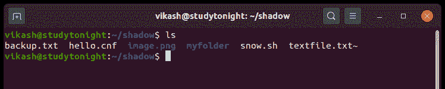
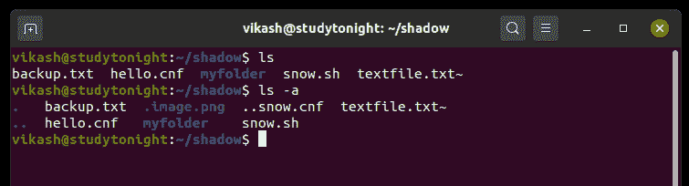
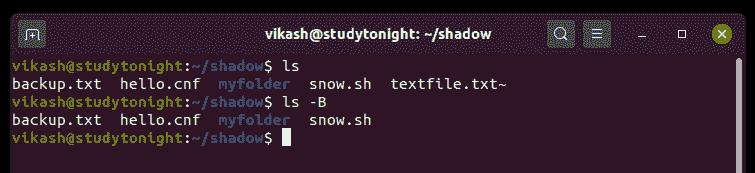
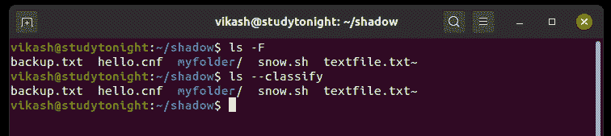

# 如何列出目录内容(`ls`命令)

> 原文：<https://www.studytonight.com/linux-guide/how-to-list-directory-content-ls-command>

在 Linux 中，要列出一个目录或子目录的所有文件，我们可以使用`ls`命令。这是每个 Linux 用户最常用的命令。我们将通过可用的选项和示例详细了解该命令。

*   如果我们使用`ls` 命令而没有任何参数的话它列出了当前工作目录中的文件和目录。
*   `ls` 命令在 EFI(可扩展固件接口)Shell中也有。
*   在其他环境中，如 DOS(磁盘操作系统)和微软视窗，类似的功能由`dir` (目录)命令提供。
*   `ls` 命令的输出是有色的，而`dir` 命令是有色的。

###`ls`命令的一般语法

以下是 Linux 中`ls`命令的语法。

```
ls [OPTION]... [FILE]...
```

### Linux`ls`命令选项

以下是 **ls** 命令可用选项的简要说明。

| 选择 | 描述 |
| --- | --- |
| -所有人 | 它用于显示隐藏的文件。 |
| -一个，-几乎所有 | 不要列出隐含的。还有。。 |
| -作者 | 用于打印每个文件的作者信息。 |
| -块大小=大小 | 它用于在打印前设置缩放尺寸。 |
| -B，-忽略-备份 | 它用于忽略备份文件的列表。 |
| 分类 | 它用于将指示符(一个*/=>@&#124;)添加到条目中。 |
| -文件类型 | 用于设置文件类型。 |
| -我，伊诺德 | 它用于打印每个文件的索引号。 |
| -r-倒车 | 它用于在排序时以相反的顺序列出文件。 |
| -R，-递归 | 它用于递归列出子目录。 |
| 救命 | 它用于显示`ls`命令的帮助。 |
| -版本 | 它用于打印`ls`命令的版本信息。 |

### 示例:列出目录的内容

在本例中，`ls`命令显示文件和目录列表。



### 示例:列出目录的隐藏内容

在这个例子中，我们使用的是`ls -a or ls --all` 命令，该命令显示所有包含隐藏文件的文件(文件以。或者..是隐藏的文件或目录)。



### 示例:用`ls`命令显示每个文件的作者

在本例中，我们将 **ls** 命令与 **-author** 选项一起使用，该选项以权限打印每个文件的作者。我们也可以使用`ls -author <file name>.`检查任何特定文件


### 示例:列出目录的内容，不包括备份文件

在本例中，我们使用`ls`命令`ls -B option in` 排除了备份文件(文件以~符号结尾)。我们也可以使用`ls --ignore-backups` 过滤备份文件。



### 示例:在`ls`命令中使用附加指示器

在本例中， **ls -F** 或**-classize**命令将文件分类为它们的类型。

*   “/”符号表示目录。
*   “*”符号表示可执行文件。
*   “@”符号表示符号链接。
*   “%”符号表示空白。
*   “=”符号表示插座。
*   “|”符号表示先进先出。



### 示例:递归列出子目录

如果一个目录包含多个子目录，并且我们想要列出所有子目录及其内容，那么 **-R** 选项可以与`ls`命令一起使用。请参见下面的命令。

```
$ ls -R
```

### 结论

在本教程中，我们介绍了如何使用`ls`命令列出 Linux 操作系统中的目录内容，以及可用的选项和合适的示例。在 Linux 中，`dir`和`vdir`也可用于列出目录及其内容，但用于其他目的。我们将在下一个教程中讨论这些内容。

* * *

* * *