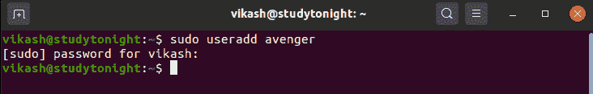
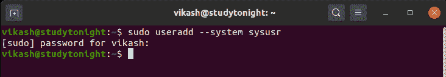
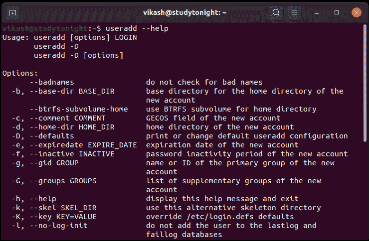

# 如何在 Linux 中添加用户？

> 原文：<https://www.studytonight.com/linux-guide/how-to-add-user-in-linux>

在 Linux 中，对于添加新用户，我们可以使用`useradd` 命令。

我们知道 Linux/Unix 是一个多用户操作系统，它意味着多个用户可以同时与系统交互。用户管理是系统管理员的责任，即应该如何管理相关任务，如创建新用户、删除现有用户等。`useradd`命令用于在 Linux 系统中创建新用户。

由 root 或`sudo`权限执行的用户管理任务。如果我们使用具有`sudo`权限的`useradd`命令，那么我们必须提供系统密码。

**命令的一般语法。**

```sh
useradd [options] LOGIN
useradd -D
useradd -D [options] 
```

useradd 命令可用选项的简要描述。

| 选择 | 描述 |
| --- | --- |
| 恶名 | 不要检查坏名字 |
| -D，-默认值 | 打印或更改默认用户添加配置 |
| -G，-group，groups | 新帐户的补充组列表 |
| -m，-创建-主页 | 创建用户的主目录 |
| -o，-非唯一的 | 允许创建具有重复(非唯一)UID 的用户 |
| -r，-系统 | 创建系统帐户 |
| 救命 | 显示帮助并退出 |

## 示例:向 Linux 操作系统添加新用户

在这个例子中，使用`sudo useradd <username>` 命令，我们可以很容易地将新用户添加到我们的系统中。这里我们不是以 root 权限执行这个命令，所以我们需要使用`sudo` 并且我们必须提供一个系统密码。



## 示例:使用-D 或- default 选项显示当前默认选项类型

在本例中，执行`useradd --default`或`useradd -D`后，当前默认选项将提示如下图所示。


## 示例:使用带有`useradd`命令的`-r`或`--system`选项创建系统用户。

在这个例子中，我们可以使用`sudo useradd --system <username>`创建一个系统用户。系统用户和普通用户的主要区别在于，系统用户是在没有截止日期的情况下创建的。



在选项表中，仅给出了几个重要的选项和描述，以了解更多关于用户添加命令用户`useradd --help`中可用选项的信息，它将提示用户添加命令中的所有可用选项。

## 

* * *

* * *