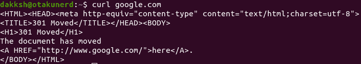
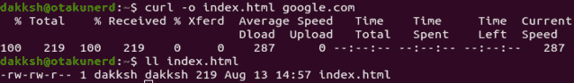
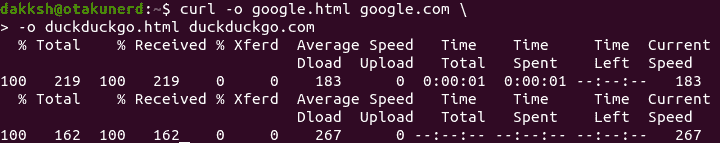
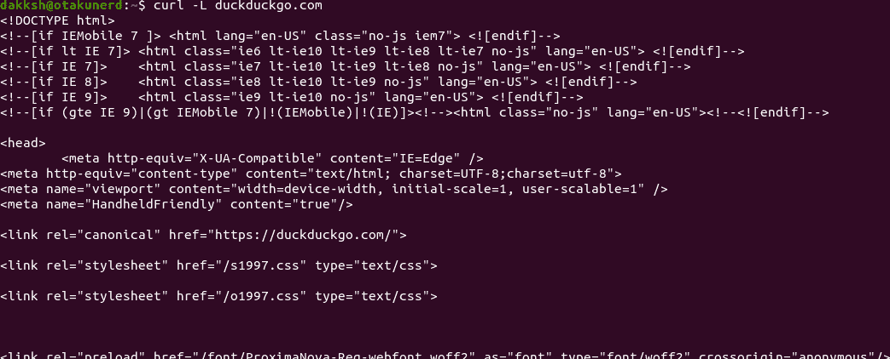
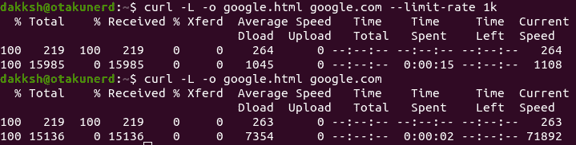

# Linux 中的 cURL 如何传输数据？

> 原文：<https://www.studytonight.com/linux-guide/curl-in-linux-how-to-transfer-data>

**cURL** ，通常写成`**curl**`，是一个 Linux 实用程序，用于从服务器或向服务器传输数据，使用任何协议，如 HTTP、HTTPS、FTP、FTPS 等(对于多文件传输`**wget**`或 FTP 是可取的)。

curl 提供了各种选项，例如恢复传输、限制带宽、代理支持等等。

## 安装 cURL

在大多数 Linux 发行版上，CUlR 是预装的，但是在极少数情况下，它不是预装的，您的发行版 repo 应该有最新版本的 CUlR。

要检查是否安装了 cURL，只需单独运行命令`**curl**`。如果没有安装 CUlR，它会返回一个 CUlR 未安装的错误，您可以使用以下命令将其安装在 Ubuntu 上。

```sh
sudo sh -c 'apt update && apt upgrade'
sudo apt install curl
```

## 使用 cURL

curl 有一个非常简单的语法，看起来像

```sh
curl [OPTIONS] [URL...]
```

例如，你想检索`google.com`的主页，我们会运行以下内容。

```sh
curl google.com
```



输出将被打印到控制台。另外，如果没有指定协议，cURL 会尝试猜测，否则默认为 HTTP。

## 保存输出

cURL 输出可以通过两种方式保存。一个使用预定义的名称，或者两个使用原始名称。两者分别由`-o`和`-O`完成。

比如取`google.com`，存储到`index.html`，运行的命令如下。

```sh
curl -o index.html gooogle.com
```



## 下载多个文件

当要下载多个文件时，我们使用多个`-o`和`-O`选项，后跟文件名和网址，或者只有网址。因此，要获取`google.com`并将其存储到`google.html`，将`duckduckgo.com`存储到`duckduckgo.html`，我们将运行以下命令。

```sh
curl -o google.html google.com -o duckduckgo.html duckduckgo.com
```



## 恢复下载

有时，由于网络崩溃、停电、低带宽和许多其他原因，我们的下载会停止。当这种情况发生时，cURL 会拯救我们。我们不需要从头再下载所有东西，有了`-C -`选项，我们就可以恢复下载，不会面临任何问题。

例如，假设您正在下载 Ubuntu-21.04 ISO，并且您的网络崩溃，我们可以使用以下命令恢复下载。

```sh
curl -O https://releases.ubuntu.com/21.04/ubuntu-21.04-desktop-amd64.iso # Download for ISO file
curl -C - -O https://releases.ubuntu.com/21.04/ubuntu-21.04-desktop-amd64.iso # Resume download by taking the previous command and adding -C -
```

## 跟踪重定向

有时一个页面已经移动了，如果你试图卷曲它，你会得到一个错误的页面，一个指向新网址的链接，或者一个带有后端服务器引擎名称的空白页面。您可以指示 cURL 按照这些重定向到新的位置，无论它们在哪里。例如，如果你卷曲`duckduckgo.com`你会得到下面的页面。


但是如果你使用重定向标志，即`-L`，它会引导到正确的站点，如下所示。

```sh
curl -L duckduckgo.com
```



## 指定最大传输速率

cURL 可以使用`--limit-rate`标志限制正在下载的文件的传输速率。可以使用`k`指定千字节的大小，`m`指定兆字节的大小，`g`指定千兆字节的大小。比如下载`google.com`首页，以 1k 的速度，我们运行以下命令。

```sh
curl -L -o google.html google.com --limit-rate 1k
```

为了看出区别，我们执行了相同的命令，一次有`--limit-rate`，一次没有。



## 使用代理

要使用代理，我们使用`-x` / `--proxy`标志，后跟代理 URL。

例如，对于 192.168.33.24 端口 8000 上的代理，我们将运行以下命令。

```sh
curl -x 192.168.33.24:8000 https://www.google.com
```

如果代理服务器需要身份验证，`-U` / `--proxy-user`标志与参数一起以如下所示的语法传递。

```sh
curl -U user:pass -x PROXY_IP:PROXY_PORT <IP or Name>
```

## 结论

本教程是如何在您的系统上安装 cURL，然后使用`**curl**`程序从远程机器下载文件的便捷指南。它还展示了如何限制带宽，以及如何通过 cURL 连接到代理，等等。

* * *

* * *