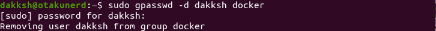
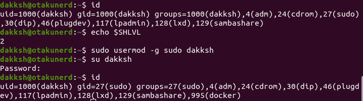
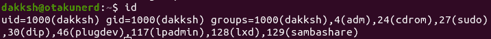
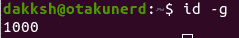
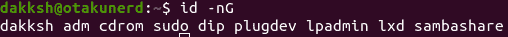

# 如何将用户添加到组？

> 原文：<https://www.studytonight.com/linux-guide/how-to-add-user-to-a-group>

改变用户所属的组是一项基本的任务，但不是每个人都知道如何去做。在本教程中，我们将与您一起讨论这一点。

## Linux 组

组是 Linux 用来组织和管理用户帐户的组织单位。组的主要目的是定义权限，如读取、写入和执行权限。

组主要有两种类型:

*   **主组**:创建文件时，`**/etc/passwd**`文件中为当前用户指定的组作为所有者组。通常，它是一个与用户同名的组。
*   **二级组**:授予某组成员一定权限时有用。例如，如果用户被添加到`docker`组，他们现在将能够执行`docker`命令。

每个用户只属于一个主要组，但属于多个次要组。

只有 root 或具有`**sudo**`访问权限的用户才能编辑用户所属的组。

## 将现有用户添加到组

如果我们已经有了用户，并且设置了组，并且我们想要添加用户，我们可以使用`**usermod**`或`**gpasswd**`(避免危险错误的更安全的选项)。例如，我们想要将用户`dakksh`添加到组`docker`中，我们将运行

```
sudo usermod -a -G docker dakksh # -a represents append. Leaving out -a, will remove user from all other groups
sudo gpasswd -a dakksh docker # Add user to group docker
```

成功时，没有输出，但如果用户或组不存在，则会显示一条错误消息。


## 将用户添加到多个组

如果我们想将一个用户添加到多个组中，我们为 **`usermod`** 命令中的`-G`标志提供一个逗号分隔的列表。因此，要将用户`dakksh`添加到组`docker`和`sambashare`中，我们运行以下命令

```
sudo usermod -a -G docker,sambashare dakksh
```


## 从组中删除用户

要从组中删除用户，我们可以使用-d 标志和`**gpasswd**`命令运行。因此要将用户`dakksh`从组`docker`中移除，我们运行

```
sudo gpasswd -d dakksh docker
```



## 创建新组

为了创建一个新的组，我们运行`**groupadd**`，如下所示。

```
sudo groupadd groupName
```

## 删除组

要删除一个组，我们运行`**groupdel**`，方式如下

```
sudo groupdel groupName
```

## 更改用户的主要组

要更改用户的`**gid**`，我们使用带有`-g`标志的`**usermod**`命令。传递给`-g`标志的参数可以是组名或 **GID** 。因此，要将当前用户的默认组更改为`**sudo**`，我们可以这样做

```
sudo usermod -g sudo dakksh
```



## 同时创建用户和分配组

要创建用户，我们可以使用 **`useradd`** 命令，但我们不能只使用该命令创建用户。我们可以分配组，甚至用这个命令指定用户的主要组。例如，我们想要创建一个分配给组`sudo`、`docker`、`sambashare`的用户`vim`，并将主组设为`dakksh` (GID 1000)，我们将运行以下命令。

```
sudo useradd -g 1000 -G sudo,docker,sambashare vim
```

## 列出用户组

使用 **`id`** 或`**groups**`我们可以列出主要和次要的用户组。`**id**`是按以下格式运行的。

```
id [OPTIONS] [USER]
```

单独运行`**id**`命令会给出`uid`、`gid`和`groups`。



使用选项参数，通过`-u`、`-g`或`-G`中的任意一个，组合或分开分别给出数值形式的`uid`、`gid`和`groups`。



通过`-n`标志，我们得到了`**id**`返回的数字标识的名称。为了获得特定用户的组，我们指定用户名。



要使用`**groups**`命令获取组，格式如下。

```
groups [USER]
```


默认情况下，如果没有提到用户，`**id**`和`**groups**`都使用当前用户。

## 结论

我们已经看到了如何使用`**gpasswd**`和`**usermod**`命令将用户添加到次要组或修改他们的主要组。

还介绍了如何创建用户并同时分配组，以及如何列出用户所属的组。

* * *

* * *