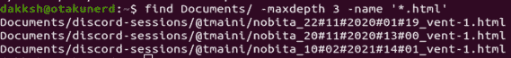
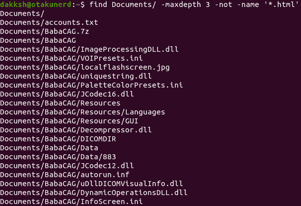
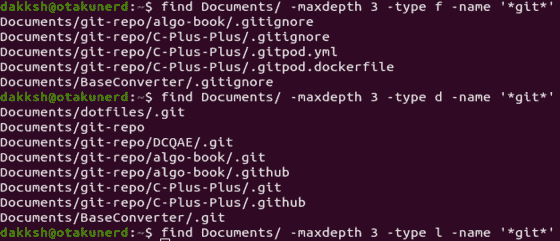
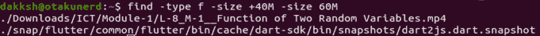
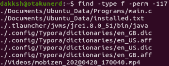
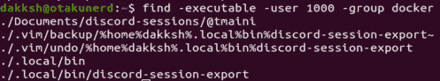

# 如何在 Linux 中找到文件？

> 原文：<https://www.studytonight.com/linux-guide/how-to-find-files-in-linux>

每个人都曾一度忘记他们把东西放在哪里，或者他们最后一次看到东西的地方，这也延伸到我们电脑上的文件和文件夹。

当我们想要找到一个文件时，我们可以通过浏览所有我们最后记得文件在哪里的文件夹来浪费宝贵的时间，或者依靠方便的 Linux 工具，比如`find`、`locate`，甚至`fzf`。

本教程将涵盖`find`程序的使用，以及如何使用众多选项中的一些来加快过程。

`find`是一个方便的 Linux 实用程序，是 SysAdmin 武库中的一个很好的工具，如果使用得当，可以节省时间。可以结合`grep`或`sed`等工具，进一步加快进程。该程序根据用户给出的表达式在目录层次结构中搜索文件和目录，并在命令行标志的帮助下，对匹配项执行用户指定的操作。

通过操纵标志，您可以使用`find`根据用户、组、上次编辑日期、类型、大小等搜索文件。

## `find`命令语法

```
find [OPTIONS] [STARTING-POINT] [EXPRESSION]
```

*   **OPTIONS** :控制符号链接的处理方式、调试选项和优化级别。
*   **起始点**:开始搜索并递归下降的路径。
*   **表达式**:指定匹配要搜索文件的表达式、正则表达式类型、递归搜索深度等选项。

要搜索任何文件，用户需要该目录的读取权限。

假设我们想在一个文件夹中搜索所有 **`HTML`** 文件，从我们的起点开始最大深度为 3，我们会写下以下内容:

```
find Documents/ -maxdepth 3 -name '*.html'
```

上述命令以下列方式运行

*   我们从当前目录的`Documents`文件夹开始搜索
*   程序应该从其当前位置最多遍历 3 个目录的深度
*   它搜索所有`**HTML**`文件，其名称中包含任意数量的字符

为了使搜索不区分大小写，例如，搜索以`**HTML**`结尾的文件，而不是`**html**`，我们可以使用 **`-iname`** 标志来代替`**-name**`，其中 I 表示不区分大小写。



现在来介绍一些最重要的 **`find`** 命令的旗帜，上面没有解释

1.  `**-not**`:

    ```
    find Documents/ -maxdepth 3 -not -name '*.html'
    ```

    对于上面的例子，所有与指定模式不匹配的文件都会被返回，因此我们可以得到一个 JPG 文件。

2.  `**-type**` :
    这指定了我们正在搜索的对象的种类。它的形式是`-type *c*`，其中`*c*`可以是多个值之一，但是普通用户使用的是`***f***`、`***l***`和`***d***`。
    `***f***`代表文件，`***d***`代表目录，`***l***`代表符号链接。因此，

    ```
    find Documents/ -maxdepth 3 -type f -name '*git*' # Files having the word git in name
    find Documents/ -maxdepth 3 -type d -name '*git*' # Folders having the word git in name
    find Documents/ -maxdepth 3 -type l -name '*git*' # Symbolic links having the word git in name
    ```

    

3.  `**-size**` :
    根据文件大小查找文件。旗帜的形式为**`-size [+-]n[cwbkMG]`**([]中的字符是可选的，表示要使用这些字符中的一个)。这些字符的含义如下

    | 性格；角色；字母 | 意义 |
    | --- | --- |
    | `±`(缺席表示文件大小准确) | `**+**` -大于指定大小的文件 |
    | `**-**` -小于指定大小的文件 |
    | `n` | 文件大小 |
    | `c` | 字节 |
    | `w` | 双字节字 |
    | `b` | 512 字节块(**默认**) |
    | `k` | 千字节(1024 字节的单位) |
    | `M` | mebi bytes(1024 * 1024 的单位= 1048576 字节) |
    | `G` | 吉比字节(1024 * 1024 * 1024 = 1073741824 字节的单位) |

    尺寸不是圆形的。这意味着 **`-1M`** 的大小与`**-1048576c**`不同，因此，前者将只匹配空文件，而后者将匹配所有大小小于 *1048576* 字节的文件。要搜索范围内的文件，可以使用如下命令

    ```
    find -type f -size +40M -size 60M # Returns all files with 40 < fileSize <= 60 M
    ```

    

4.  **`-mtime``-daystart`**:
    `-mtime`是`**-mtime [+-]n**`的形式，其中 n 代表`*n * 24*`小时。`±`与`-size`的意思相同。`**-daystart**`用于使时间测量从当天开始开始，而不是从 24 小时前开始。
    因此要找到一个不到 5 天前编辑过的文件，从今天开始，我们会使用

    ```
    find -type f -mtime -5 -daystart
    ```

5.  `**-perm**` :
    通过权限查找文件，我们使用`-perm`。如果按原样使用`-perm`，它将匹配确切的权限，例如 **`-perm 664`** ，将为用户和组匹配所有具有读写权限的文件，但只为其他人匹配读取权限。如果权限号前面有一个 **`/`** ，则它确保至少一个权限(用户、组或其他)匹配。如果许可号前面加了一个`**-**`，则保证至少设置了那些位，如果设置了更多位也没关系。因此，如果我们搜索一个标志为`**-perm -117**`的文件，如果该文件的权限为 *777* ，它将返回该文件作为真正的匹配。

    

6.  **`-user``-group`**:

    *   `-user`用于通过提供**用户名**或 **UID** 来查找特定用户拥有的所有文件

    *   `-group`用于查找某个组拥有的文件，使用**组**或 **GID**
        因此，要搜索 UID 为 1000 的用户和组 docker 拥有的所有文件，我们将运行

    ```
    find -executable -user 1000 -group docker
    ```

    

7.  **`-delete`** :
    对于给定的表达式，该选项删除所有返回真的文件。

8.  **`-execdir``-executable`**:
    `-execdir`用于对文件和/或目录执行与用户指定的选项和模式相匹配的命令来运行命令。字符串`{}`扩展为当前文件名，每个文件运行一次指定的命令。以下所有文本都被视为命令，直到没有遇到`;`为止。为了避免被 shell 扩展，这些字符串应该被引用，或者用`\`字符转义。`-executable`另一方面，用于匹配可执行文件。

    

## 结论

本教程已经介绍了`find`命令，以及如何利用它来搜索文件系统中的文件和/或目录。它还涵盖了如何优化您的搜索，以及如何在文件上运行命令，而无需制作辅助列表。

* * *

* * *