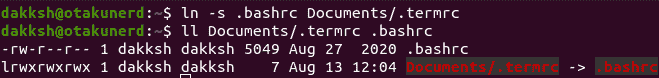
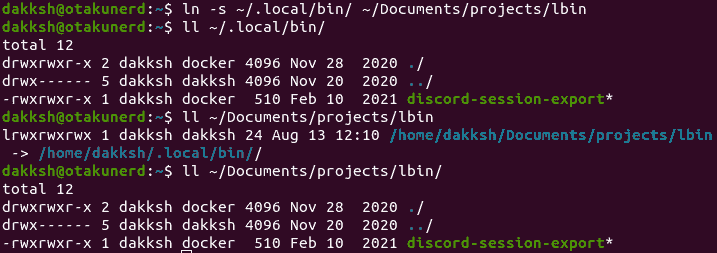
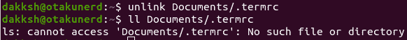
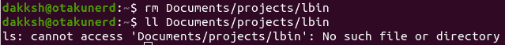
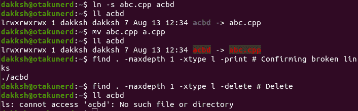

# 在 Linux 上创建符号链接

> 原文：<https://www.studytonight.com/linux-guide/creating-symlinks-on-linux>

符号链接，也称为软链接或符号链接，是 Linux 系统上的一个特殊文件，它指向系统上的另一个文件或文件夹。在 Linux 系统上，这些大约相当于一个 Windows 快捷方式。

## 符号链接和快捷方式的区别

符号链接不像快捷方式那样充当指向不同文件或文件夹的指针。符号链接的作用就像对象实际存在一样。

例如，我们想将一个文件夹同步到 dropbox，但不想将其移动到 dropbox。创建快捷方式将使 dropbox 引用该文件位置，因此如果我们在另一个系统上访问它，它将失败。但是有了符号链接，Dropbox 认为文件就在那里，并同步文件夹内容，让我们甚至可以访问其他系统。

## 符号链接的应用

*   内存高效快捷方式。从不同的文件夹中执行相同的应用，但是只消耗几个字节来创建符号链接。
*   将数据或应用移动到另一个驱动器，而不中断工作。

## 创建符号链接

要从命令行创建符号链接，基本命令格式如下。

```
ln -s <path to file/folder> <path of link>
```

`**ln**`，是链接命令。`-s`用于指定我们的链接是象征性的和/或软的。默认情况下`**ln**`只创建硬链接，所以我们需要记住指定`-s`标志。依次是源文件/文件夹，然后是快捷方式的目标。

### 符号链接文件

以符号链接一个文件为例，将你的 **`~`** 目录中的`.bashrc`文件，链接到`**Documents/**`目录中的一个`.termrc`文件，我们运行如下。

```
ln -s .bashrc Documents/.termrc
```

要检查文件是否是符号链接，请运行命令

```
ls -l Documents/.termrc
```

如果第一列是`l`，说明是链接。



### 符号链接文件夹

例如，要对文件夹进行符号链接以访问`~/Documents/projects/`中的`~/.local/bin/`(用户本地可执行文件)，我们将运行以下命令。

```
ln -s ~/.local/bin/ ~/Documents/projects/lbin
```



## 删除符号链接

符号链接可以通过两种方式取消链接。一种是使用`**unlink**`命令。

### 取消符号链接

`**unlink**`有以下语法。

```
unlink <path to link>
```

如果过程成功，这将删除链接。需要记住的一点是，即使符号链接是针对某个文件夹的，我们也不会添加尾随的“`/`”，因为 Linux 假设它是一个目录，并且 unlink 不能删除目录。



### 删除符号链接

因为符号链接只不过是 Linux 文件系统上的一个特殊文件，所以它可以像 Linux 文件一样被删除。通过使用`**rm**`。就像`**unlink**`一样，如果符号链接是指向某个文件夹的，则不会添加尾随的“`/`”。

`**rm**`(删除)符号链接的语法如下。

```
rm Documents/projects/lbin
```



使用`**rm**`优于`**unlink**`的好处是可以使用`**rm**`同时删除多个链接。

## 查找和删除断开的链接

有时有太多的链接需要跟踪，我们已经多次修改了我们的文件，由于丢失文件或重命名文件夹等原因，我们最终会出现悬空/断开的链接。为了解决这个问题，我们可以在 Linux 上使用方便的 [`**find**`](https://www.studytonight.com/tutorials/preview?subject=linux-guide&url=how-to-find-files-in-linux) 程序找到所有断开的链接。`**find**`是一个 Linux 实用程序，可以搜索符号链接，也可以删除符号链接。

要搜索断开的符号链接，请使用命令

```
find . -maxdepth 1 -xtype l -print # Max Depth to be used to find links, only in current folder, without recursive search
find . -maxdepth 1 -xtype l -delete # Delete after confirmation of files using -print
```

因此，例如，下面的命令被用来创建一个符号链接，然后移动原始文件，我们得到。

```
ln -s abc.cpp acbd
ll acbd # Check on link
mv abc.cpp a.cpp
ll acbd
```

我们可以看到，文件`acbd`，现在是一个断开的链接。要搜索和删除它，我们使用`**find**`命令和`-delete`标志。



## 结论

本教程讲述了如何使用带有`-s`标志的 **`ln`** 命令创建软/符号链接，以及如何使用`**unlink**`和`**rm**`处理这些链接。它还涵盖了如何找到任何因事故而中断的链接，并删除它们。

* * *

* * *