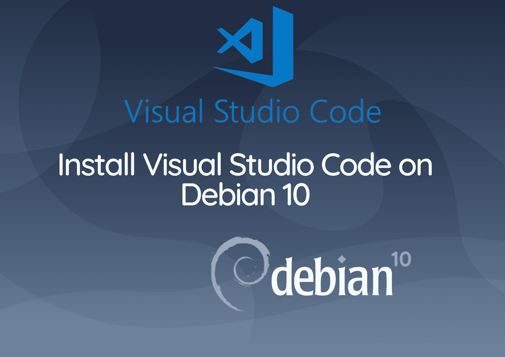

# 在 Debian 10 上安装 VSCode

> 原文：<https://www.studytonight.com/linux-guide/install-visual-studio-code-on-debian-10>



今天，我们介绍**如何在 Debian 10** 巴斯特上安装 VSCode或更新现有 VS 代码；Visual Studio Code 是由**微软**创建的开源跨平台代码编辑器。Visual Studio 提供内置调试帮助、Git 集成控件、语法突出显示、代码完成、集成终端、代码重构和代码片段。

在 Debian 10 上安装 **Visual Studio Code** 的最快且推荐的方法是激活 VS Code 存储库，并使用命令行安装 VS Code 包。

本指南描述了在 **Debian 10 Buster 上安装 VSCode编辑器。**更新 Debian 10 上的 VS 代码

## 前提

要在 Debian 10 上安装 Visual Studio Code，您必须以具有 **Sudo** 访问权限的用户身份登录。

### 在 Debian 10 上安装 VSCode

在 **Debian** 10 系统上安装 VSCode的最快和推荐的方法是激活 VS 代码存储库，并使用命令行安装 VS 代码包:

首先更新包索引并通过键入以下命令安装**依赖项**:

```
sudo apt update
sudo apt install software-properties-common apt-transport-HTTP curl
```

使用以下命令 curl 导入**微软 GPG** 键:

```
curl -SSL https://packages.microsoft.com/keys/microsoft.asc | sudo apt-key add -
```

该命令将产生一个**输出** OK。

### 将 VSCode存储库添加到您的系统中:

```
sudo add-apt-repository "deb [arch=amd64] https://packages.microsoft.com/repos/vscode stable main"
```

安装 **VSCode**包，使用:

```
sudo apt update sudo apt install code
```

Visual Studio Code 安装在 **Debian** 桌面上，可以开始使用了。

## 启动 VSCode

通过输入代码或点击 VS 代码图标(“应用程序- >编程- > VSCode”)，可以从**命令**行打开 VS 代码。
你现在可以开始添加**扩展**并根据你的喜好定制 VS 代码。

## 如何更新 VSCode

发布新版本的 **Visual Studio Code** 时，您可以通过桌面使用软件更新工具或在终端中键入以下命令来更新软件包:

```
sudo apt update && sudo apt upgrade
```

## 结论

我们已经教过你如何在 Debian 10 系统上安装 **VSCode**或者更新 VS 代码。您的下一步是安装附加组件并个性化您的用户和设置**工作区**。

* * *

* * *