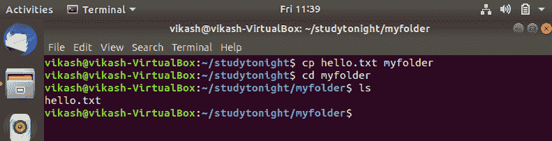
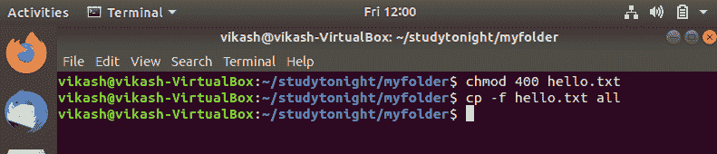
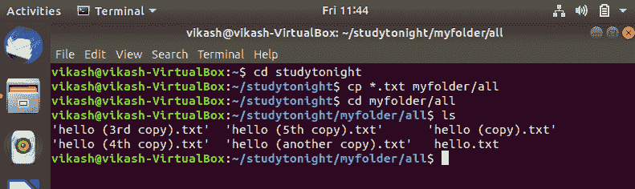

# 如何在 Linux 中复制文件或目录

> 原文：<https://www.studytonight.com/linux-guide/how-to-copy-a-file-or-directory-in-linux-cp-command>

在 Linux 中，如果我们想要复制一个文件或目录，我们使用`cp`命令。

`cp`(复制)命令用于复制 Linux/Unix 操作系统中的文件或文件组或目录。在 Linux 中，`install`命令也可用于在 Linux 操作系统中复制文件和设置任何文件或目录的属性。

`cp`命令在以下模式下工作:

1.  如果您为文件的路径名提供了两个参数，该命令会将第一个文件的内容复制到第二个文件，创建第二个文件，如果该文件不存在，则`cp`命令会创建它。

2.  如果您想要复制多个文件或目录，那么源路径将包含所有要复制的文件名，而目标路径必须是一个目录。

3.  如果源是一个目录，而目标也是一个目录，那么 cp 命令会将第一个目录的所有内容复制到第二个目录中。

`cp`命令的一般语法如下:

```
cp [ option] source destination
```

### Linux cp 命令选项

`cp`命令可用选项的简要说明。

| 

[计]选项

 | 

描述

 |
| --- | --- |
| -b | 它用于创建每个目标文件的备份。 |
| -f | 如果需要，可以通过删除目标文件来强制复制。 |
| ［构成来自拉丁语、结尾为-us 的名词的复数］ | 它用于获得用户交互。 |
| -我-s | 它用于创建硬/符号链接，而不是物理副本。 |
| -我 | 它用于跟随符号链接。 |
| 同-EN | 它用于设置无文件覆盖。 |
| -右 | 它用于递归复制(包括隐藏文件)。 |
| -你 | 它用于更新。仅当源比目标新或目标丢失时，它才会复制。 |
| -v | 详细(输出发生的每个步骤) |

### 示例:在 Linux 中复制文件

这里，我们使用`cp`命令将一个文件复制到一个文件夹中，然后通过使用`cd`命令进入来验证它。cd 命令用于改变 Linux 中的目录。查看命令。



### 文件在 Linux 中的复制和备份

**-b(备份)** -这个带有 cp 命令的选项在目标目录中创建一个或多个备份文件。我们可以使用如下命令:

```
cp -b hello.txt myfolder 
```

它将复制文件 **hello.txt** 作为目标文件夹以及一个备份文件，该文件包含一个带有文件名的平铺符号。

**hello.txt ~** 是前一个 hello 的备份文件。txt 文件。

### 在 linux 中强制复制文件

**-f (force) -** 此选项用于强制复制文件或目录。如果任何文件或目录受到写权限的保护，那么通过使用 cp 命令的 **-f** 选项，我们可以成功地从源复制到目标。



### 在 Linux 中复制多个文件

Linux 允许将多个文件或目录复制到任何目的地。

在此命令中，当前目录中以. txt 扩展名结尾的所有文件都被复制到另一个目录中。



### 结论

在本教程中，我们介绍了如何使用 cp 命令复制文件、文件组或目录，以及 cp 命令中可用的各种选项和合适的示例。

* * *

* * *