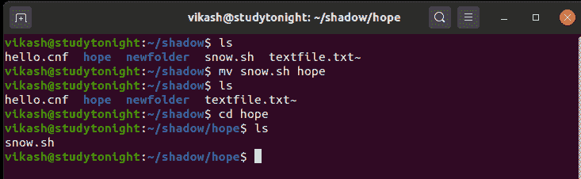
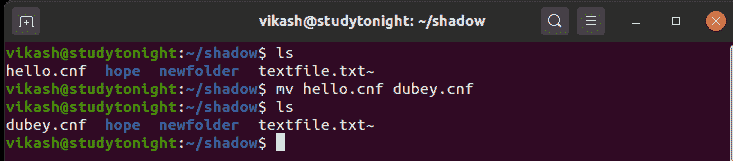
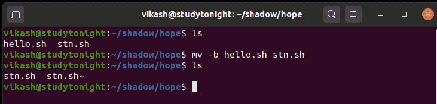

# 如何在 Linux 中移动文件或目录

> 原文：<https://www.studytonight.com/linux-guide/how-to-move-a-file-or-directory-in-linux>

在 Linux 中，如果我们想移动一个文件或目录，可以使用`mv` 命令。例如，

```
$ mv myfile.txt /destination/folder
```

`mv` (移动)命令用于移动一个或多个文件或目录。

`mv` 命令也用于重命名文件或目录，`mv` 命令的主要优点是在重命名过程中不会消耗磁盘上的额外空间。

###`mv`命令的一般语法

```
mv [OPTION]... SOURCE... DIRECTORY
```

### Linux`mv`命令选项

下表简要描述了 **mv** 命令的可用选项。

| 选择 | 描述 |
| --- | --- |
| -备份[=控制] | 它用于备份每个现有的目标文件。 |
| -b | 它类似于- backup，但不接受参数。 |
| 力 | 覆盖前不会提示。它移动有力。 |
| -不-不，笨蛋 | 不要覆盖现有文件 |
| -带尾斜线 | 它用于从每个 SOURCE 参数中移除任何尾随斜线。 |
| -S，后缀=后缀 | 它覆盖了通常的备份后缀。 |
| 目标目录 | 它将所有 SOURCE 参数移动到 DIRECTORY 中。 |
| -T，- no-target-directory=DIRECTORY | 它将 DEST 视为正常文件。 |
| u 更新 | 只有当源文件比目标文件新时，它才会移动。 |
| -v，-冗长 | 它用来解释正在做的事情。 |
| -Z，-上下文 | 它用于将目标文件的 SELinux 安全上下文设置为默认类型。 |
| 救命 | 它显示帮助。 |

## 将文件从一个目录移动到另一个目录

在本例中， **snow.sh** 文件在**阴影**目录中可用，并通过使用 **mv** 命令 **snow.sh** 文件移动到目标目录。



## 使用`mv`命令重命名文件

这里使用`mv`命令后的文件 **hello.cnf** 被重命名为 **dubey.cnf** 文件，该文件已经不存在了。如果目标文件已经存在，那么它将被覆盖，并且源文件将被自动删除，不会有任何提示。



## 备份现有文件

在本例中，使用`mv`命令的 **-b** (备份)选项，更容易对`mv`命令将覆盖的现有文件进行备份。我们可以看到，执行这个命令后 stn.sh~文件是用波浪号字符(~)创建的。



## 结论

在本教程中，我们介绍了如何在 Linux/Unix 中使用`mv` 命令移动一个或多个文件或目录，`mv`命令中提供了相应的选项。

* * *

* * *