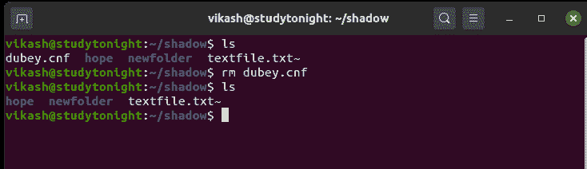
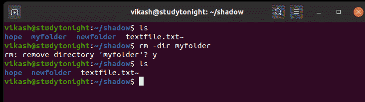
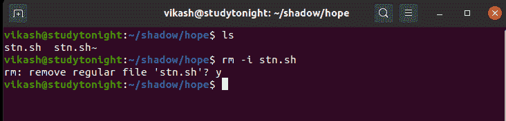
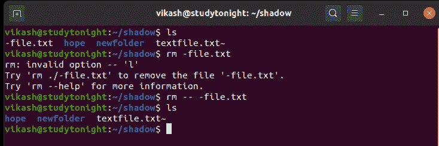

# 如何删除 Linux 中的文件或目录？

> 原文：<https://www.studytonight.com/linux-guide/how-to-remove-files-or-directories-linux>

在 Linux 中，如果我们想删除文件和目录，可以使用`rm`命令。

以下命令用于**递归删除目录**，这意味着它也将删除其子目录，这意味着完全删除:

```sh
rm -rf /path/of/directory/
```

`-r`标志为**递归删除**，`-f`为**强制删除**。所以使用这个命令来完全删除一个目录以及其中的任何内容。

要删除单个文件，运行以下命令:

```sh
rm myfile.txt
```

`rm`(删除)命令可用于删除文件和目录。您可以使用**完整路径**或**相对文件路径**来指定要删除的文件的位置。

`rm`命令默认不删除目录，要删除目录，我们应该使用 **-d 标志**或 **-r 标志**，我们在上面的例子中使用了这两个标志。

`rm`命令是无声杀手，就是它无声工作，成功完成后不会在屏幕上打印任何输出消息。`rm`命令仅在出现错误时生成消息，因此使用该命令时应小心。

### `rm`命令的语法:

下面是如何使用这个命令，

```sh
rm [OPTION]... FILE...
```

### Linux `rm`命令选项:

下表简要描述了可通过`rm`命令使用的**选项**。

| 选择 | 描述 |
| --- | --- |
| `-f`、`--force` | 添加此标志将删除目录或文件，无论如何。这意味着强制拆除。 |
| `-i` | 它用于显示信息，并在每次移除前与用户确认。 |
| `-I` | 用于删除三个以上文件前提示一次(与`-i`标志相同)。 |
| `--interactive[=WHEN]` | 它用于根据我们提供的条件进行提示。 |
| `--one-file-system` | 它在递归移除层次结构时使用。 |
| `--no-preserve-root` | 它用于指定不应区别对待根，也可以将其删除。 |
| `--preserve-root` | 此标志也是默认选项，不允许删除根目录。 |
| `-d`、`--dir` | 它用于删除空目录。 |
| `-r`、`-R`、`--recursive` | 它用于递归删除目录及其内容。 |
| `-v`、`--verbose` | 它用来解释正在做的事情。每个文件名都打印在控制台上，该命令会将其删除。 |
| `--help` | 用于显示与`rm`命令相关的帮助。 |
| `--version` | 它用于从`rm`命令获取版本信息。 |

## 
示例:使用`rm`命令从存储器中删除文件。

在这个例子中，通过使用`rm`命令，我们将删除一个在**阴影**目录中可用的文件**。**



## 示例:删除空目录

在这个例子中，**我的文件夹**是一个空目录。仅仅使用`rm`命令是不可能删除目录的。所以要删除一个目录，你必须使用`-dir`选项和命令。



## 示例:使用带有`-i`(交互式删除)选项的`rm`命令删除文件

在本例中，我们将`-i`选项与`rm`命令一起使用，该命令要求用户在删除每个文件之前进行确认。



## 示例:删除以-(连字符)符号开头的文件

如果任何文件在其名称中使用-(连字符)，那么我们不能使用`rm`命令直接删除它。我们必须在文件名前单独使用`--` ( **双连字符**)，就像选项一样，删除文件。

这是`rm`命令不会将文件名误解为**选项**的方式。



## 结论

在本教程中，我们介绍了如何使用 rm 命令删除文件和目录，以及可用的选项和合适的示例。rm 命令类似于 MS-DOS 和 Windows 操作系统中的 del 命令。

* * *

* * *