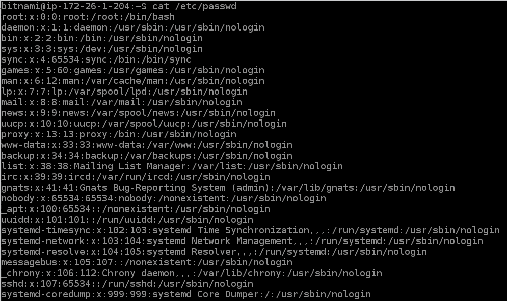
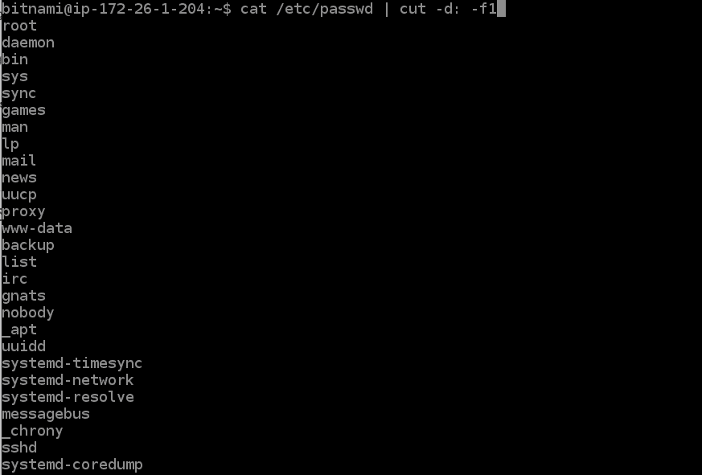
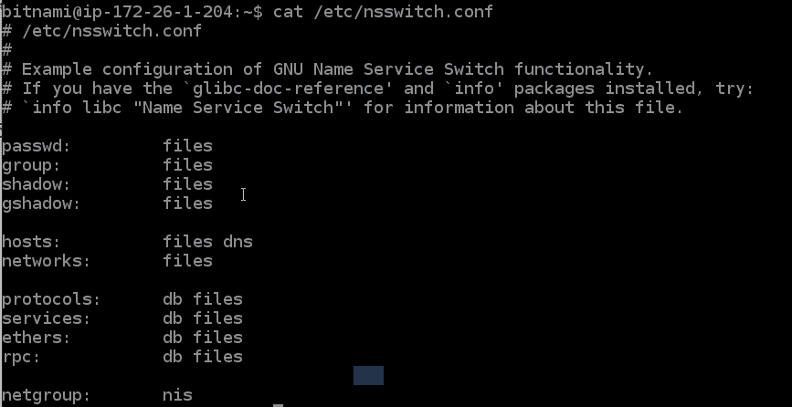
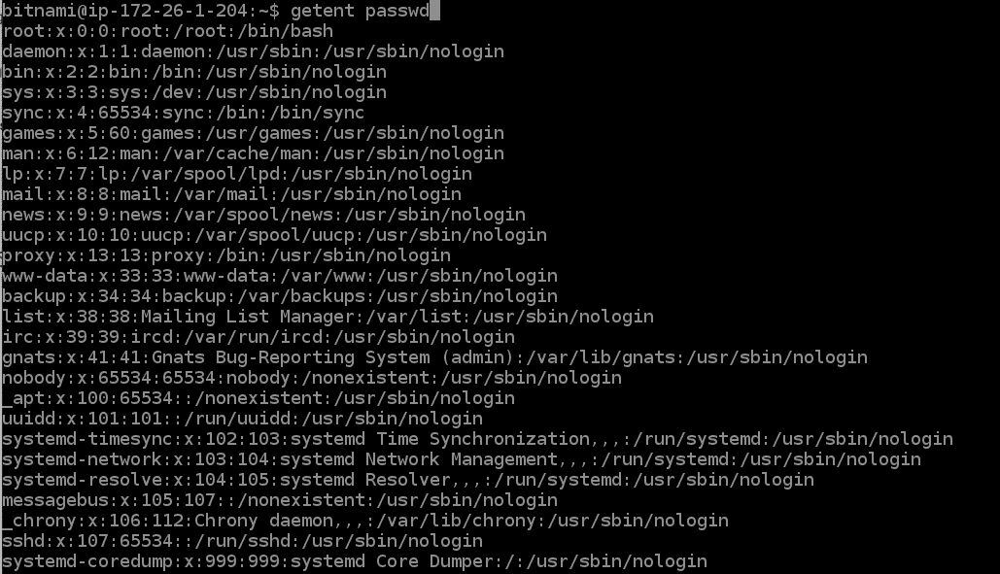

# 如何在 Linux 中列出用户？

> 原文：<https://www.studytonight.com/linux-guide/how-to-list-users-in-linux>

如果你是一个系统管理员，或者一般来说想看到你的 Linux 机器上的所有用户，那么在本教程中，你将学习 3 种不同的方法来做到这一点。

如果你只是希望这个命令没有任何废话，那么这里有一个命令，你可以在你的 Linux 机器上运行，列出用户，以及其他一些信息:

```
cat /etc/passwd
```

**/etc/passwd** 文件保存了用户的所有信息。在这个命令中，我们使用了`cat`命令来读取这个文件。

如果你想通过一些额外的提示和技巧来学习这三种不同的方法，那就继续阅读。

以下是列出 Linux 用户的三种方法:

1.  读取 **/etc/passwd** 文件

2.  使用`getent`命令

3.  使用`compgen`命令

让我们一个接一个地讨论它们，在讨论时分享一些关于每一个的独特见解。

## 1.正在读取/etc/passwd 文件

我们可以使用`cat`、`less`或`more`命令读取 **/etc/passwd** 文件，列出所有用户。以下是命令:

```
cat /etc/passwd

less /etc/passwd

more /etc/passwd 
```



当您运行以上任何一个命令时，您将获得系统上所有可用用户的列表，以及其他相关信息，用冒号**(`:`)隔开。每行都有一个用户的信息。**

 **注意:这是您机器上所有可用用户的列表，并不意味着登录用户。要检查当前登录的用户，请使用 who 命令。

**/etc/passwd** 文件存储了所有用户的列表，以及关于他们的以下信息:

*   用户名。

*   加密密码(值`x`表示密码存储在 **/etc/shadow** 文件中)。

*   用户标识号。

*   用户的组标识号(GID)。

*   通常仅作为用户名的注释。

*   用户主目录-对于某些用户，该目录可以为空。

*   登录外壳(默认值为`/bin/bash`)。


### 如何使用/etc/passwd 只显示用户名？

我们可以使用`awk`命令或`cut`命令。要使用这些命令，我们首先使用 cat 命令列出 **/etc/passwd** 文件的内容，然后使用**管道操作符**，然后使用`cut`或`awk`命令仅显示**第一列数据**，这是**用户名**。

运行以下命令之一:

```
cat /etc/passwd | cut -d: -f1
```

或者使用以下命令:

```
cat /etc/passwd | awk -F: '{print $1}'
```

运行以上任何命令，您将看到以下输出:



## 2.使用`getent`命令列出用户:

在 Linux 机器中，文件 **/etc/nsswitch.conf** 存储配置的数据库列表。您可以使用`cat`命令查看该文件的内容。



正如您在上面的输出中看到的，输出中还列出了 **passwd** 数据库。使用`getent`命令，我们可以访问它并列出所有用户。下面是命令:

```
getent passwd
```

`getnet`命令的输出类似于 **/etc/passwd** 文件的内容。



### 如何使用`getent`命令只显示用户名？

如果您想使用`getent`命令列出用户名，我们可以使用`awk`命令或`cut`命令。

以下是使用`cut`命令的命令:

```
getent passwd | cut -d: -f1
```

或者用`awk`命令:

```
getent passwd | awk -F: '{print $1}'
```

## 3.使用`compgen`命令列出用户

如果我们只想列出用户名，那么我们也可以使用`compgen`命令。这个命令更容易用来列出你的 Linux 系统中所有可用的用户名。

下面是如何使用这个命令:

```
compgen -u
```


### 如何检查用户名是否存在？

在创建任何新用户之前，您可以使用`compgen`命令检查用户名是否已经存在。我们可以使用 grep 命令从所有可用的用户名中搜索任何特定的用户名。

如果要搜索**守护程序**用户名，请运行以下命令:

```
compgen -u | grep 'daemon'
```

我们也可以在其他两种方法中使用`grep`命令，但是命令会变得复杂，这一种更容易。

## 检查 Linux 中的当前活动用户

以上 3 种方法将列出您的 Linux 系统中所有可用的用户。但是如果你想看到当前的活跃用户，可以使用`who`命令。

例如，

```
who
```

今晚研究 pts/0 2021-07-13 12:14(62 . 27 . 117 . 907)

在上面的输出中，我们获得了当前活动的用户，我们使用该用户登录了系统。如果多个用户登录到同一个 Linux 机器上，输出可以有多个用户名。

## 结论:

至此，本指南到此结束。我们介绍了在 Linux 中列出用户的 3 种不同方法，以及各种其他快捷方式，如仅列出用户名和搜索特定用户名。

* * *

* * ***