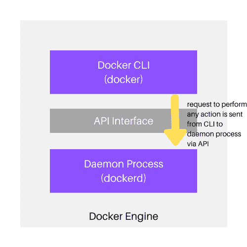

# 容器和Docker介绍

> 原文：<https://www.studytonight.com/docker/introduction-to-containers-and-docker>

为了理解什么是 Docker 以及为什么使用它，我们必须首先知道什么是容器，以及它们解决了什么问题。**容器是完全隔离的环境**，设置在现有操作系统之上，为运行在其中的应用程序提供与外部世界的虚拟隔离。docker 是一个帮助我们控制这些容器生命周期的软件。

如果你不能理解它，不要太担心。让我们举一个简单的日常生活例子来帮助你理解容器的概念。

> 假设一个房客住在他/她与房东家合租的房子里，或者假设是另一个房客。房客有一个单独的房间、浴室和厨房来满足他的基本需求。现在，如果我们把房子看作一个操作系统，把租户可用的区域看作一个容器，那么租户就独自生活在他的区域内，按照自己的要求管理它，不受其他人的干扰，但它共享房子的一些公共资源，如电、水等。

同样的，**容器是建立在操作系统**之上的一个孤立的环境(用户空间)，其中利用了同一个 OS Kernel 但是有自己的进程、服务、网络、存储挂载就像虚拟机一样，但是容器不是虚拟机(我们很快就会了解到 VM 和容器的区别。).

**Docker 软件帮助我们管理这些容器的生命周期**，包括设置容器、监控容器、销毁容器、将容器连接到网络等。

容器化是一个古老的概念，因为有一些技术可以实现容器设置，并且已经使用了 10 多年。创建容器的其他方法有:

1.  LXC

2.  旗舰版

3.  LXCFS 等。

**Docker 最初是在 LXC 的基础上创建的**，但后来转向了自己创建容器的方式。按照 LXC 的方法，容器被创建为 Linux 内核之上的隔离环境，使用**cggroups(控制组)进行资源管理**，如 CPU、内存、网络等，以及**隔离的名称空间，为运行不同容器的应用程序**创建单独的用户空间。

是的，容器是一个古老的概念，是的，我们只能使用 Linux 内核来创建容器，因为只有 Linux 提供了对 cgroups 和名称空间的支持。

**组**限制容器可以使用的空间，而**命名空间**限制容器可以看到的空间。

既然你已经理解了容器，让我们来谈谈 docker。

## 什么是 Docker 或 Docker 引擎？

Docker 或 Docker Engine 是一个软件，它帮助我们管理容器的生命周期，定义它们将如何设置，它们将在其中运行什么应用程序/软件/服务，它们的网络需求，它们的存储需求，以及如果需要，如何轻松销毁容器并重新开始。

Docker 使用 **docker 图像**来运行容器内的进程。稍后我们将详细了解 docker 映像，现在，将它们视为在 docker 容器中安装任何服务所需的文件。

<u>**注:**</u> 由于容器化是 Linux OS 的特性，因此 docker 只能安装在像 Ubuntu、Fedora、Redhat 等 Linux 操作系统上。如果你想在 Windows 操作系统上使用 docker，你必须设置一个 Linux 虚拟机，在上面你可以安装 docker。Docker Windows 应用程序将自动安装一个虚拟机，并在其上运行 Docker 引擎。

在客户机-服务器体系结构中，Docker 或 Docker 引擎由 3 个组件组成:

1.  带有守护进程的服务器(`dockerd`)

2.  一种应用编程接口，由程序用来与 docker 守护进程进行交互。

3.  以及一个命令行界面`docker`，使用它我们可以运行 docker 命令来对 docker 守护进程执行不同的操作。

**命令行界面**使用**应用编程接口**与**Docker守护程序**进程交互。docker 守护程序负责创建和管理 docker 对象，如容器、映像、网络和卷。我们将在接下来的教程中了解所有这些 docker 对象。

## 为什么要用 Docker？

由于对微服务和 devops 的需求不断增加，docker 如今在软件行业非常受欢迎，因为它帮助开发人员和系统管理员在容器中构建和运行应用程序。以下是让 docker 如此受欢迎的一些事情:

### 1.它很灵活:

您可以使用 docker 在容器中运行一个简单的 hello world 程序，可以在 docker 容器中运行一个像 Apache HTTP 服务器或 Nginx 这样的 web 服务器，可以在 docker 容器中运行任何重量级的应用程序，甚至可以使用 docker 在容器中运行操作系统。

虽然 docker 不建议在容器内运行操作系统，但是你可以这样做。

### 2.不同服务的轻松设置

如果你必须在一个服务器上安装多个小服务，比如一个网络服务器、一个数据库、一些编程语言以及一些其他需要的服务，传统上我们只需要把它安装在一个服务器上，在那里它们将互相共享所有的服务器资源，并为相同的资源而战。

但是有了 docker，我们可以为每个服务创建一个单独的容器，根据他们的要求为他们分配资源，建立彼此之间的通信，这样就完成了。

即使一个服务获得太多的负载，它也绝不会影响在其他容器中运行的服务。

### 3.它是可移植的-不用担心一次又一次的环境设置

当我们在本地机器上开发完一些应用程序，并且必须在生产中部署这些应用程序时，我们会面临很多环境设置问题。但是如果您正在使用 docker，您可以定义容器设置的步骤，docker 将确保每次无论您在哪里运行它，环境都以相同的方式进行设置。

### 4.Docker容器是松散耦合的

容器是一个自给自足的单元，具有自己的资源配额、自己的网络设置等，这使得它完全封装，从而使系统管理员更容易在不影响其他容器的情况下替换或升级一个容器。

### 5.高度安全

Docker 自动确保容器与外部进程完全隔离。

### 6.码头容器很轻

与虚拟机不同，docker 容器是轻量级的，因为它们只是利用运行它们的机器的底层操作系统内核来创建一个单独的用户空间。

## 结论:

在本教程中，我们了解了容器、容器化、docker 或 docker 引擎、docker 客户机-服务器体系结构的概念，以及为什么 docker 在当今软件行业如此受欢迎。在下一个教程中，我们将深入了解这些容器与虚拟机有何不同。

* * *

* * *