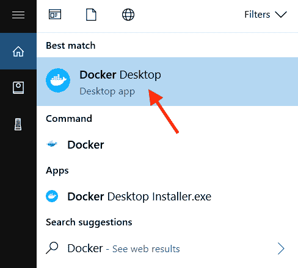

# 在 Windows 上安装 Docker

> 原文：<https://www.studytonight.com/docker/install-docker-on-windows>

Docker 提供了一个桌面应用程序，非常容易在 Windows 操作系统上安装和运行。我们知道 [docker 容器是基于 Linux 内核](https://www.studytonight.com/docker/introduction-to-containers-and-docker)的，并且所有在 Docker 中运行的容器都使用相同的 OS 内核，那么 Docker 设置在 Windows 环境下是如何工作的呢？

从 Windows 10 开始，虚拟机与 docker 用于其设置的操作系统一起打包。对于 Windows 10，Docker 桌面应用可以从 [Docker Hub - Docker 桌面应用 Windows](https://hub.docker.com/editions/community/docker-ce-desktop-windows/) 下载。

对于 Windows 10 之前的 Windows 版本，我们将不得不遵循 docker 安装的传统方法，这需要[在 Windows](https://docs.docker.com/toolbox/toolbox_install_windows/) 上安装 docker 工具箱。你可以从 Docker 工具箱的官方 [Github 资源库](https://github.com/docker/toolbox/releases)中找到所有不同版本的 Docker 工具箱。docker 工具箱包括一个 **Oracle VM Virtualbox** (以及其他必需的组件)，它用它来设置容器所需的 Linux 内核。

因此，让我们先一步一步地为 Windows 10 安装 Docker Desktop 应用程序，然后我们将介绍更多关于为旧版本的 Windows 设置 Docker 工具箱的内容。

## 窗口系统要求:

对于 Docker 桌面应用程序，您应该拥有 **64 位 Windows 10** ，并且必须启用 **Hyper-V 和容器窗口功能**。

就内存而言，至少需要 4 GB 内存**。不要担心启用 Windows Hyper-V 功能，docker 桌面应用程序将在安装过程中处理此问题。**

<u>**注意:**</u> 在 Windows 上启用 Hyper-V 后，系统上任何配置的 VirtualBox 都将停止工作。

## 在 Windows 上安装 Docker

1.  下载 [docker 桌面的 windows 可执行文件](https://hub.docker.com/editions/community/docker-ce-desktop-windows/)双击开始安装。

2.  按照安装向导上的说明**接受许可**、**授权安装人员**、**继续安装**。

3.  您可能需要在安装过程中提供系统密码，因为安装程序需要特权访问才能安装各种组件和管理 Hyper-V 虚拟机。

4.  设置完成后，点击**完成**，启动 Docker 桌面应用程序。

## 在 Windows 上运行/启动 Docker 应用程序

一旦您成功安装了 docker 桌面应用程序，您将必须启动该应用程序，因为它在安装后不会自动启动。

进入**开始菜单**，**搜索 Docker** ，**点击 Docker 桌面**。



你会看到一个**移动鲸鱼图标**出现在你的任务栏中，这意味着 docker 桌面应用程序正在启动。等待这个鲸鱼图标停止移动并变得稳定，这意味着 docker 已经开始。


一旦 docker 桌面应用程序启动，您可以使用**窗口命令提示符运行 docker 命令**。

要验证安装，请运行以下命令来检查安装的 docker 版本:

```
docker --version
```

Docker 版本 19.03.1

您应该会看到 docker 的版本号，如上面的输出所示。

## 卸载 Docker 桌面

就像我们卸载 Windows 中的任何其他应用程序一样，我们也可以卸载 docker 桌面应用程序。

1.  从**窗口开始菜单**中，选择**设置>应用程序>应用程序&功能**。

2.  从**应用程序&功能列表**中选择 **Docker 桌面**，然后选择**卸载**。

3.  点击**卸载**确认选择。

一旦您从 Windows 机器上卸载 docker 桌面应用程序，它将销毁所有容器，删除所有 docker 映像以及与 docker 引擎和 docker 桌面应用程序相关的所有其他文件。

## 旧版视窗/苹果电脑的 Docker 工具箱

如本教程开头所述，如果您使用的是 Windows 7 或更早的版本，那么您将不得不遵循不同的方法在您的 Windows 机器上安装 docker。

docker 工具箱包含以下内容:

*   **Docker机器**运行`docker-machine`命令

*   **Docker引擎**用于运行`docker`命令

*   **Docker编写**运行`docker-compose`命令

*   **Kitematic** ，Docker 图形用户界面

*   预配置用于 **Docker 命令行**环境的外壳

*   **Oracle VirtualBox**

我们强烈建议在学习 docker 时，使用适用于 Windows 10 的最新**桌面应用程序，以获得最佳体验。**

在下一个教程中，我们将介绍如何在 Mac OS 上**安装 Docker。如果您是 Windows 用户，您可以跳过下一个教程。**

* * *

* * *