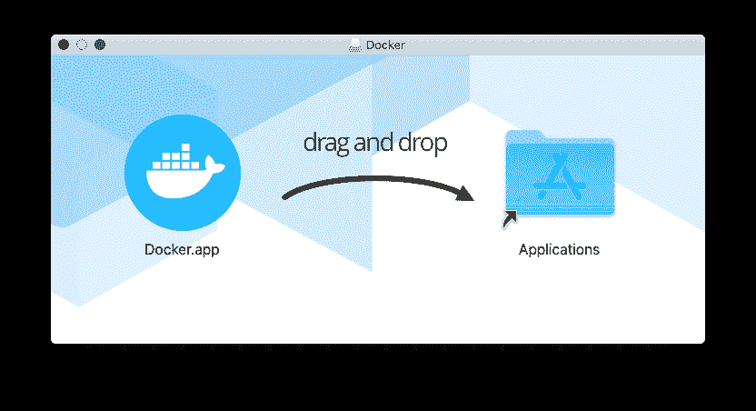
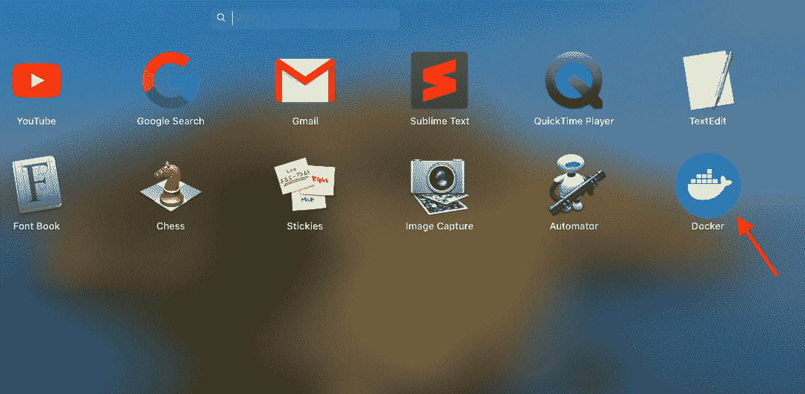
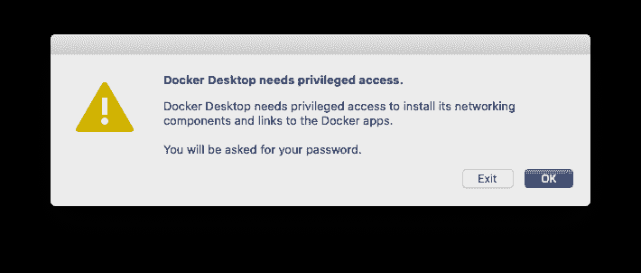
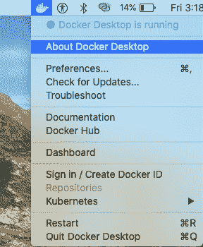
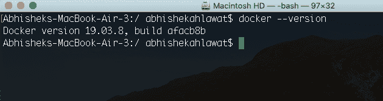
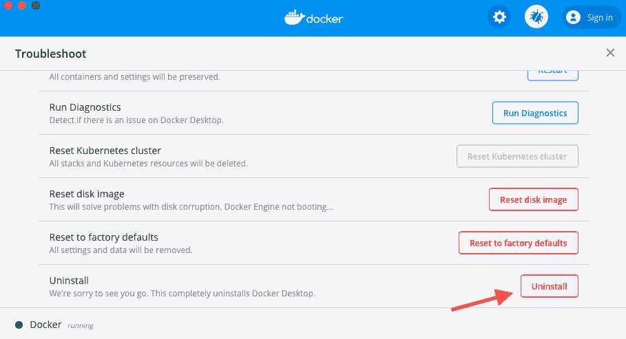

> 哎哎哎:# t0]https://www . studytonight . com/docker/install-docker-on-MAC-OS

# 在 Mac OS 上安装 docker

Docker 提供了一个桌面应用程序，非常容易在 Mac 操作系统上安装和运行。就像我们在 windows 10 上安装 docker 桌面应用程序和老版本的 docker 工具箱一样。同样，最新的 docker 桌面应用程序适用于 Mac OS，而**适用于旧版本的 Mac OS**我们将不得不设置 **docker 工具箱**来运行 Docker。

## 码头工人电脑系统要求

你应该让你的 Mac OS 运行不早于 2010 年的硬件**，因为 docker 桌面应用将需要英特尔对**内存管理单元(MMU)虚拟化**的硬件支持，包括**扩展页表(EPT)** 和**无限制模式**。**

 **Mac OS **版本应为 10.13 或更新版本**，为以下版本之一:**卡特琳娜****莫哈韦**或**高塞拉**

以及最少 **4 GB 内存**。

## 在 Mac OS 上安装 docker

从[码头工人中心-码头工人桌面下载**码头工人. dmg** 文件。](https://hub.docker.com/editions/community/docker-ce-desktop-mac/)

点击下载的 docker.dmg 文件到**打开并挂载**。打开后，您将看到以下弹出窗口:



按照弹出窗口中的指示，**将 docker.app 图标拖放到应用程序**文件夹中，开始安装。

安装完成后，**卸载 docker.dmg** 文件。

## Mac 上的“开始坞站桌面”

双击**应用程序文件夹**或**启动面板**中的 **Docker 图标**。



由于 docker 应用程序需要特权访问，您将被要求输入您的**系统密码**。



点击**确定**，并提供您的系统密码继续。

一旦码头工人开始工作，你会看到**鲸鱼图标出现在顶部导航栏**中，你可以点击它查看更多码头工人相关选项。



要验证码头工人是否已成功启动，**在终端运行以下命令**:

```
docker --version
```



## 卸载坞站(Mac OS)

要从 Mac OS 卸载 docker desktop 应用程序，请单击顶部导航栏中的 **Docker 鲸图标**，从 Docker 菜单选项中，单击**故障排除**，然后单击**卸载**卸载 Docker Desktop 应用程序。



因此，在本教程中，我们学习了在 Mac OS 上安装 docker 桌面应用程序。从下一个教程开始，我们将开始玩 docker，并开始学习 docker 的概念。

* * *

* * ***