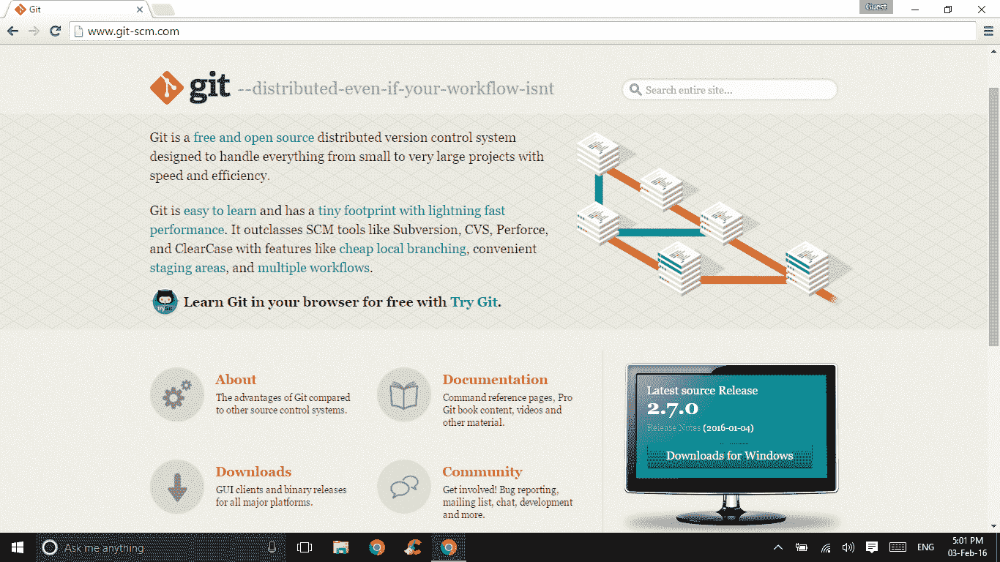
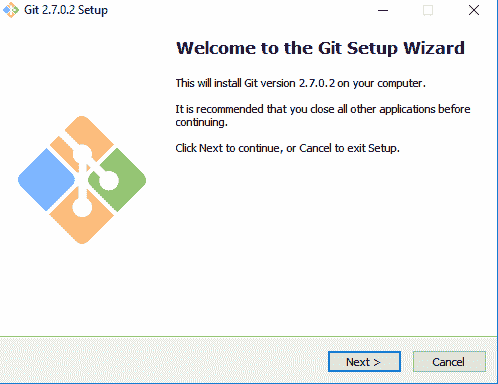
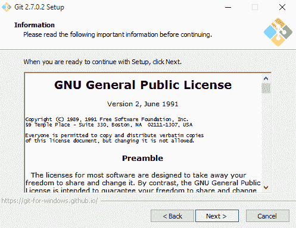
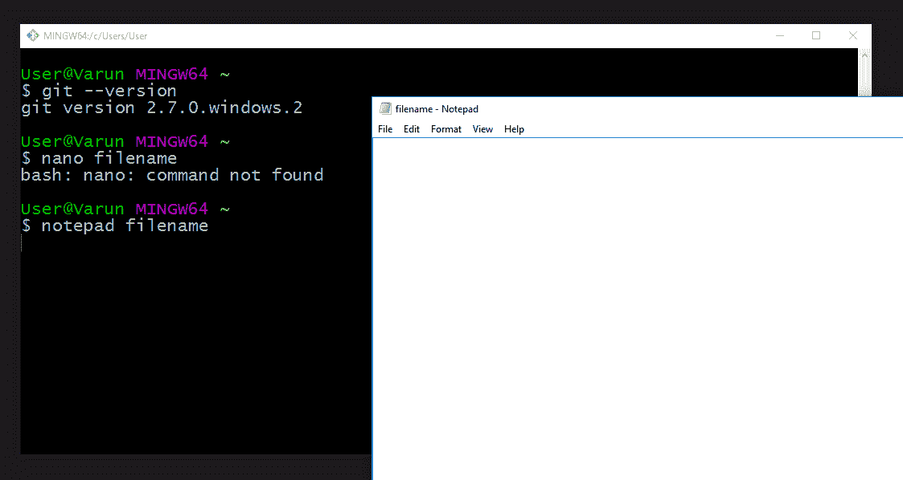

# GIT 安装

> 原文：<https://www.studytonight.com/github/install-git>

现在我们已经知道了什么是**版本控制系统**，让我们确保您的计算机上已经安装了`Git`版本，这样就可以很容易地进行操作。

* * *

## 吉卜赛人

如果你有一台苹果电脑，好消息！默认情况下，它会出现在您的系统上。直接进入[下一章](repositories-in-git)。

* * *

## Windows 中的 GIT

前往[这个链接](http://git-scm.com/)。您会注意到网站会识别您的操作系统，并提示您下载最新版本。

继续从软件包安装。打开安装程序后，只需点击**下一步**，使用**默认设置**安装 Git，因为它们是推荐设置。如果需要，您可以更改**安装目录**。

*   安装完成后进入**开始菜单**，寻找 **Git 文件夹/图标**。您可能会看到两个选项，`Git GUI`或`Git Bash`。有些人更喜欢使用图形用户界面，但我们将在本课程中重点介绍**命令行**。但是随时可以查看 Git GUI。
*   Git Bash 是一个类似于 Unix Bash 的命令行界面。它将运行我们在课程中使用的几乎所有命令。继续，通过在命令行中键入 **$git - version** 进行测试。

不同之处在于，我们将使用纳米编辑器来编辑文件，而这在 Windows 操作系统上是不可用的。

例如:我们将输入 **$ nano filename** 来打开一个文件，但是在 **Windows 机器上输入这个将导致命令未找到错误。相反，你可以输入 **$记事本文件名**，就可以工作了！**

* * *

## Linux 中的 GIT

如果您想通过二进制安装程序在 Linux 上安装基本的 Git 工具，您通常可以通过发行版附带的**基本包管理工具**来完成。

*   例如，如果你在 **Fedora** 上，你可以使用 yum: **$ sudo yum 安装 git-all** 。
*   如果你在一个基于 Debian 的发行版上，比如 T2 Ubuntu，试试 apt-get: **$ sudo apt-get 安装 git-all**

好了，现在我们有了最新的版本，让我们开始使用 Git。

* * *

* * *