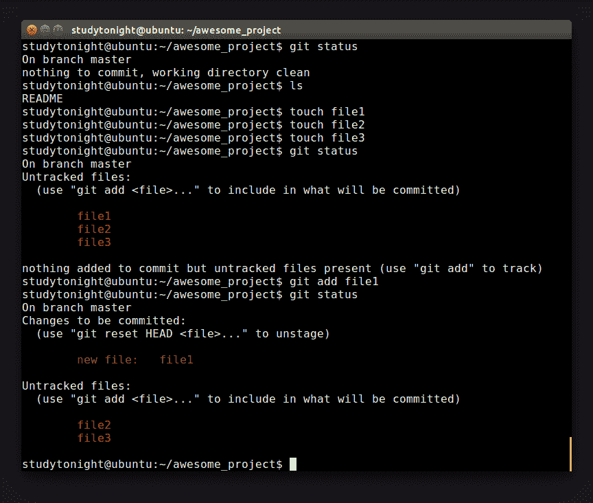
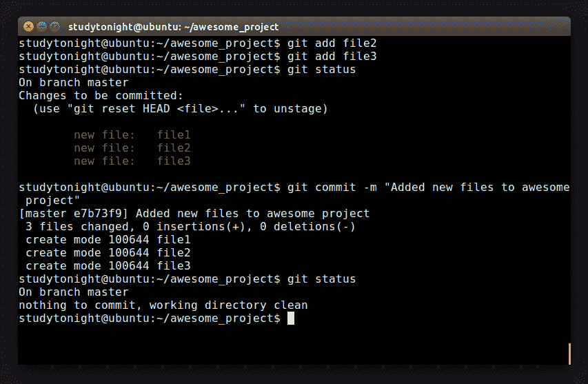
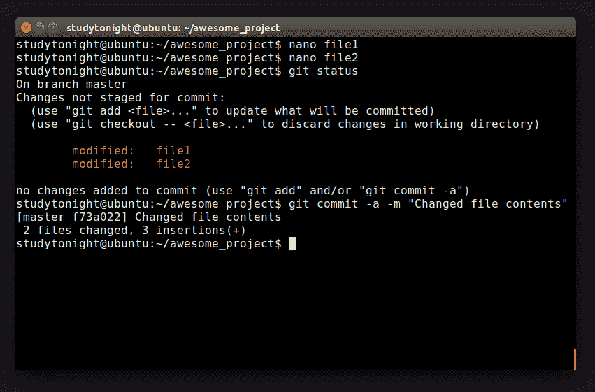

# 暂存区

> 原文：<https://www.studytonight.com/github/staging-area-in-git>

到目前为止，我们要么只向仓库中添加一个文件，要么一次添加多个文件。如果我们想要控制我们提交给仓库的内容，该怎么办？如前所述，Git 为我们提供了一个`Staging Area`，使得控制我们的提交变得更加容易。首先，确保你已经回到了我们令人敬畏的项目库。

```
Now, run the following command on your terminal: $ git status
```

正如您可能已经猜到的，该命令将给出该仓库的状态。输出现在看起来很无聊。

请注意“工作目录清理”语句。换句话说，没有**跟踪的**和**修改的**文件。Git 也看不到任何未跟踪的文件，否则它们会列在这里。最后，该命令会告诉您所在的分支，并通知您它没有从服务器上的同一个分支分叉。目前，该分支始终为`"master"`，为默认；在这里你不会担心的。

但是我们已经将**自述文件**添加到我们的仓库中，并且在状态中似乎没有它的迹象。

Git 状态将只显示分配了一些特殊状态的文件。自提交自述文件以来，没有对其进行任何修改。因此，到目前为止，该文件的状态对它来说并不重要。如果它显示了仓库中所有文件的状态，那么当您在处理一个大项目时，这将是一个漫长而乏味的任务。

我们的项目目录有点空，只包含自述文件。继续创建一些文件(空的也可以)。再次运行**状态命令**看看有没有什么激动人心的事情在等着我们！



确实有！注意我们这次没有得到**‘工作目录清理’**消息，你能猜到为什么吗？

没错。我们向项目中添加了一些尚未添加到仓库中的新文件。继续将文件 1 添加到仓库中(回想一下，我们可以使用 **git add 命令**)。再次运行**状态命令**将会发出新的信息。事情越来越令人兴奋了！



现在，您可以提交这个文件，或者将文件 2 和文件 3 添加到仓库中，然后将它们一起提交。在我们继续之前，在编辑器中打开文件，并向其中添加一些内容。当您再次检查状态时，Git 会明确告诉您这些文件已经被修改。这项功能有助于您在处理大型项目时保持冷静。



尝试创建更多的文件，并四处寻找自己！在下一章中，我们将研究更多的 Git 基础知识。走吧！

* * *

* * *