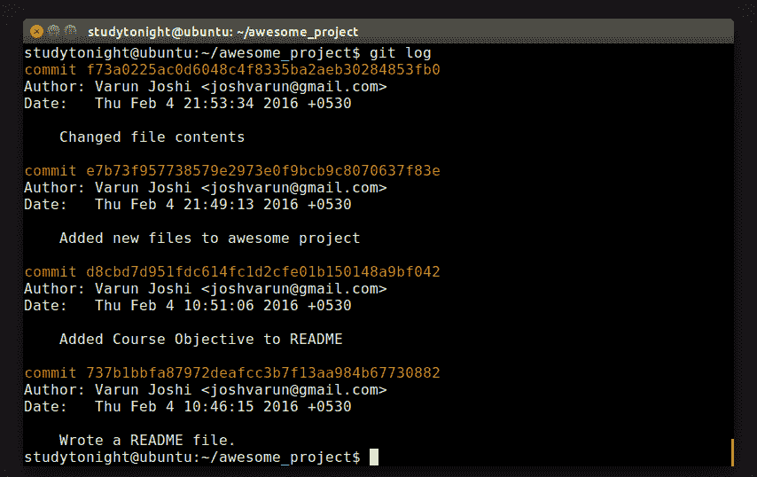
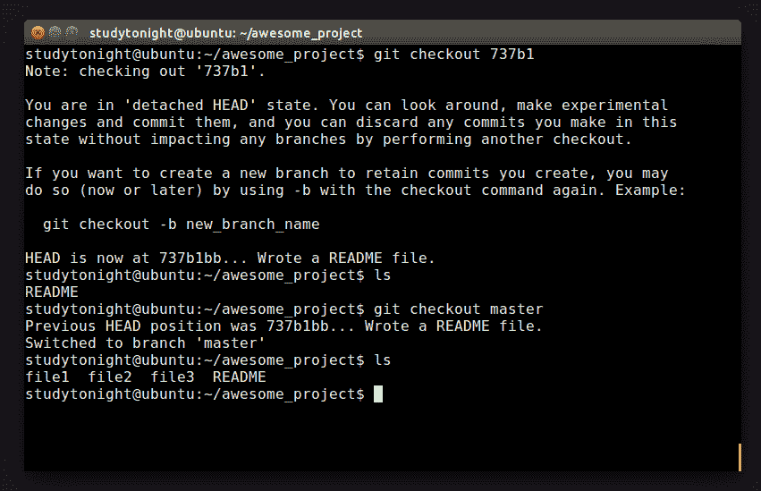
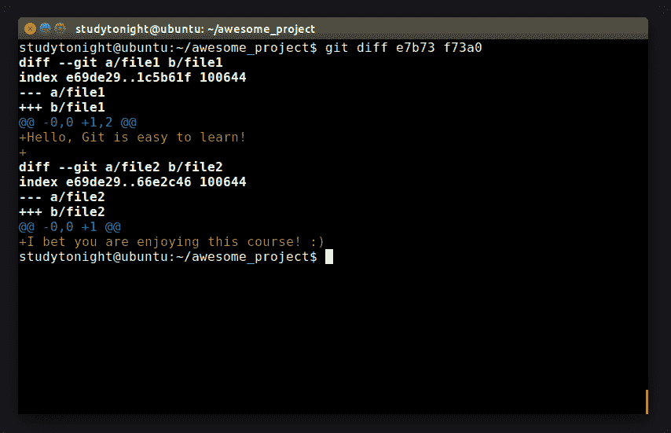

# GIT：回顾我们的仓库

> 原文：<https://www.studytonight.com/github/more-about-repository-in-git>

在本教程中，我们将学习更多关于仓库的知识，如仓库日志、在 repo 中提交、检查提交的差异等。

* * *

## 信息技术:仓库日志

好吧。因此，我们现在对 Git 及其命令有了很多了解。Git 不仅为您提供了一种维护文件的方法，还为您提供了在需要时签出旧版本文件的工具。开始之前，请确保我们所有的文件都在您的目录中。

我们将使用的第一个命令是`git log`，正如您所料，它向您显示了您在仓库中的所有提交的日志。log 命令首先显示最近的提交。向下滚动将显示我们添加的关于自述文件的第一个提交。让我们分解这个日志的输出。



它以每次提交的唯一标识符开始。回想一下，我们讨论过 Git 使用阿沙-1 散列来保证安全性。这被用作唯一标识符。您可能认为用数字来命名提交更容易。虽然这是真的，但是有些仓库是公共的，并且有大量的人参与其中，所以在提交发生时很难对它们进行编号。

标识符下面是发起提交的**作者姓名**。这使得跟踪谁对你的项目有贡献成为可能。下面是关于提交日期时间信息。

最后，我们看到提交消息本身。请注意，每条消息都提供了关于该提交中所做工作的足够信息。现在考虑这样一种情况，您在项目中添加了一个特性，但是被客户拒绝了。有了这个日志，您可以准确地检查这个特性是什么时候添加的，以及与之关联的提交标识符。

* * *

## 签出一个提交

现在你知道这个功能是什么时候添加的了。但是如何检查该特性的代码呢？别担心，我们不需要真正的时间机器来获取代码。Git 为我们提供了回到过去并检查这段代码的功能。

Git 使用**‘git check out’**命令来恢复早期版本。为此，它需要提交标识符。我们实际上不必键入长哈希值，因为让我们面对它，我们很懒。我们只需要提交标识的前 5-6 个字符，我们就可以开始了(大多数时候)。

哦哦。一个可怕的信息。一种超然的精神状态。好吧，Git 只是告诉你，你已经签出了文件的早期版本！同样，在这里进行改变也可能是危险的。让我们检查我们的第一个承诺。继续输入`ls`。如果您已经遵循了教程的步骤，您可能只会看到自述文件。嗯。太奇怪了。没有文件，文件 2，文件 3 的踪迹。



在我们被它吓到之前，让我们理解我们正在检查一个旧版本的仓库。当我们第一次启动提交时，我们根本没有文件，文件 2，文件 3！这解释了为什么没有这些文件。

* * *

## GIT：检查提交中的差异

让我们回到现在。我们可以再次使用**【git 结账】**，但是我们回到哪里呢？如果你还记得**“git status”**命令，它会显示一条信息**“在分支机构主机上”**。

Running the following command will bring you back to the current repository state:

```sh
$ git checkout master
```

再次键入`ls`以确保您的所有文件都可用。我们有另一种方法来检查旧版本。`git diff`派上用场了。它显示了两个州之间的差异。只需使用第一次提交和最后一次提交的标识符运行命令。跳过输出中的前几行。勾选`+ sign`表示添加了内容。然后，它继续显示实际的变化。



有更清晰、更容易使用的图形界面，但这是它的基础。这都是关于 Git 的基础知识。让我们深入一点，好吗？

* * *

* * *