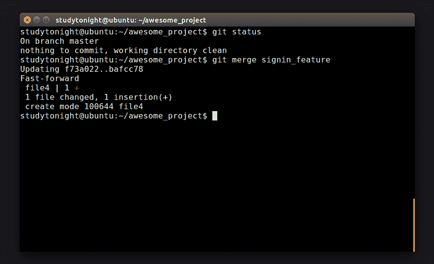
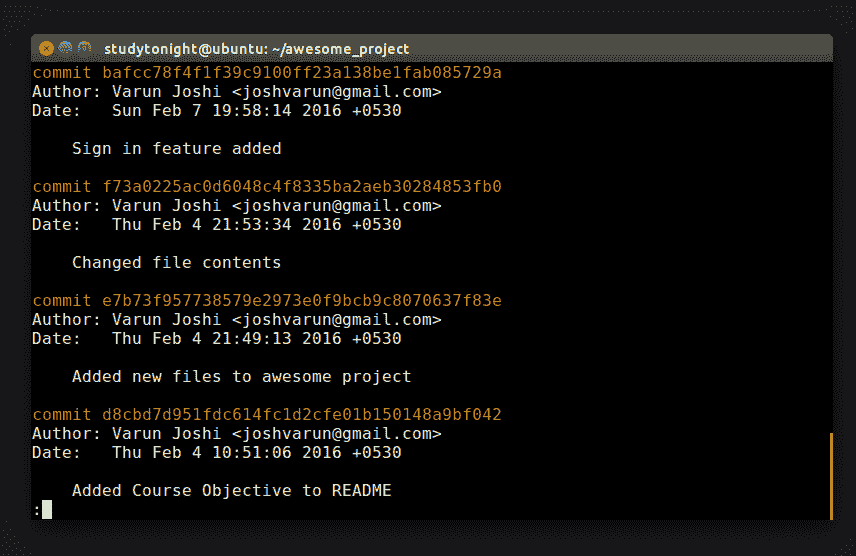
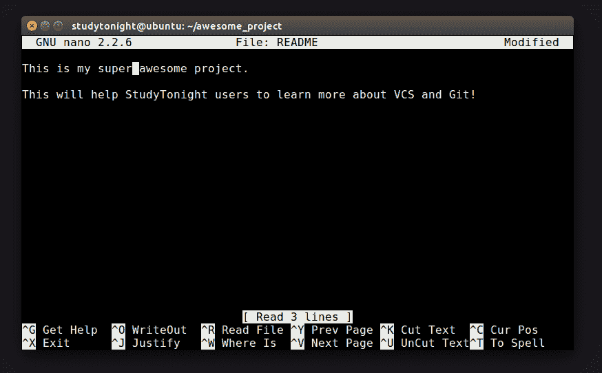
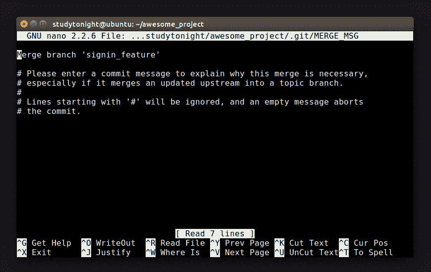
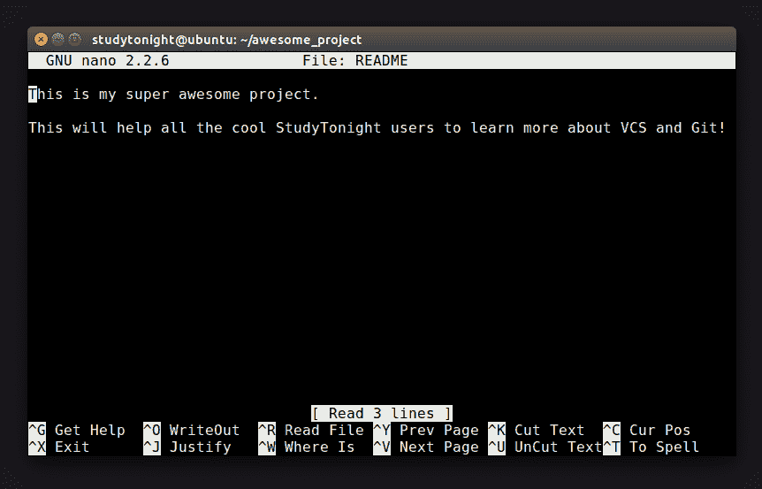

# GIT：合并分支

> 原文：<https://www.studytonight.com/github/merging-in-git>

你可能已经猜到了未来会发生什么。在最后一章中，我们创建了几个分支来帮助我们组织工作。我们创造了树枝，希望有一天它们能帮助这棵树长成它的最终形态。让我们继续上一章的例子。

回想一下，我们创建了两个新分支`signin_feature`和`subs_feature`，由于不再需要后者，所以删除了后者。到目前为止，我们只有两个分支，但是在一个更大的项目中，您可能有数百甚至数千个分支。所以你的项目看起来可能有很多平行的分支。最终目标是将所有这些分支合并成一个最终副本。你可以考虑合并作为分支的对立面。

`Merging`结合两个分支的变化，形成一个内聚分支。它还结合了来自分支的所有提交。正在合并的分支不会被删除，它仍然可用，即使在合并后，您也可以继续处理它。

但是我们如何处理两个分支中被更改的文件。我们如何决定我们希望将哪个版本延续到最终项目？这种情况被称为合并冲突。虽然大多数 VCS 提供了合并的选择，但他们把解决合并冲突的责任留给了你。不太聪明。这是 Git 比大多数 VCS 更好的另一个领域。

Git 在解决合并冲突方面相当聪明，并且大多数情况下会尝试自动解决它们。当它无法确定选择哪个文件时，它可能会要求您解决问题，让我们稍后再讨论这个问题。在本章中，我们将看到 Git 如何围绕合并工作并自动解决合并冲突。

假设我们一直在进行`signin_feature`的工作，您最终感觉到需要提交它并将其添加到主项目中，即主分支。我们还没有改变任何事情，所以不存在合并冲突的可能性。让我们继续将**登录分支**合并到我们的主分支。在这种情况下，合并是一个快速而无痛的命令。快速运行**状态命令**来知道你在哪个分支上。我们希望在主分支上，所以如果您还没有这样做，请切换到主分支。

继续运行 **$ git 日志**查看提交历史在主节点上的样子，并运行以下命令将分支**“sign _ feature”**合并到主节点。

```sh
$ git merge signin_feature
```



运行 **$ git 日志**命令并检查更改。果然，我们的提交历史现在已经合并了。这很容易，因为没有冲突需要解决。



让我们开始设置一个让 Git 解决的冲突。打开自述文件，更改第一行。将此变更提交给主节点并检查`signin_feature`分支。



再次更改自述文件的内容。这次在一条**不同的线上**。提交它并签出主分支。像以前一样运行**合并**命令。


这次输出不一样。Git 告诉我们它正在自动更新 README。它已成功检测到两个分支中的文件都已更改。但是因为它们在不同的线上，Git 能够合并它们。运行 **$ git 日志**这次也给了我们一个新的提交消息！

```sh
Merge branch 'signin_feature'
```





分支`signin_feature`仍然可用。该分支的日志显示没有任何更改。它只影响了主分支。所以这在 Git 看来既简单又聪明。但是 Git 不能决定做什么的时候呢？地狱破会输吗？让我们在下一章找到答案...

* * *

* * *