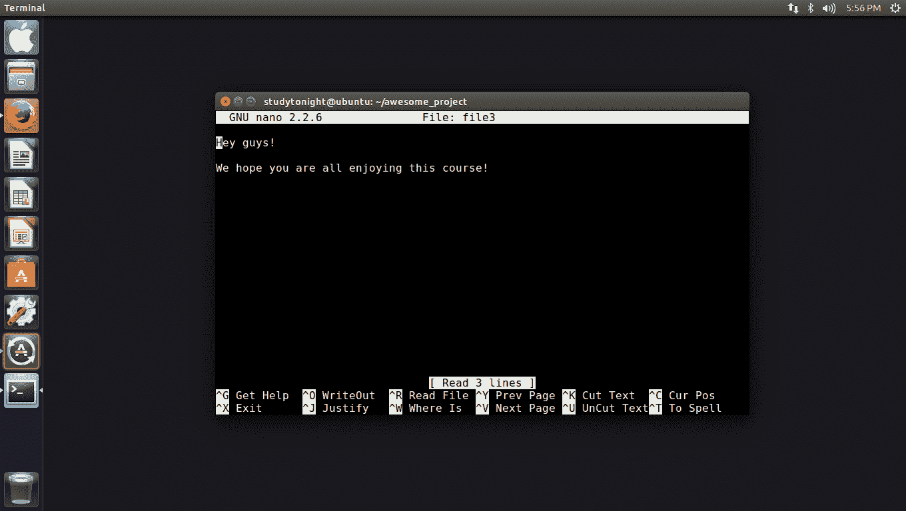
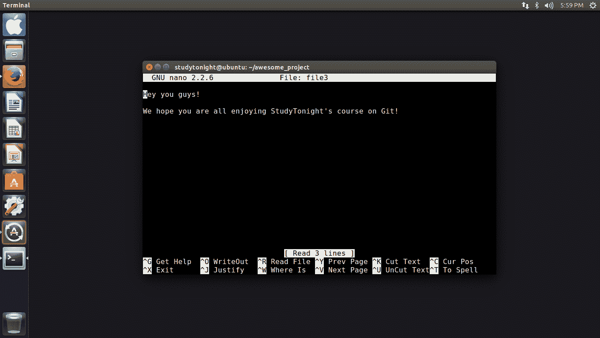
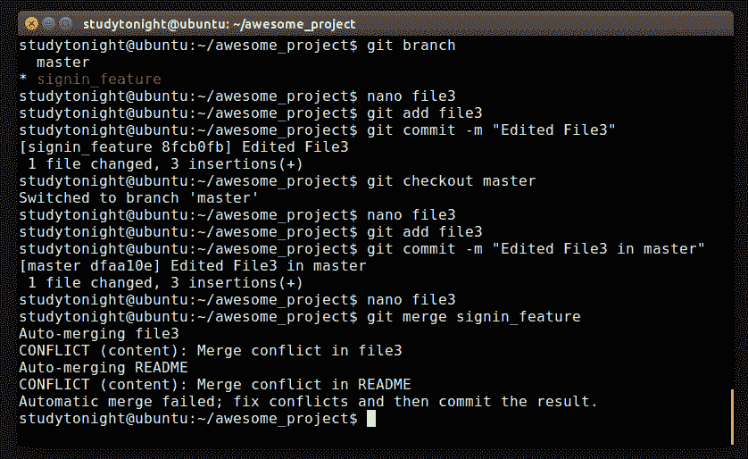
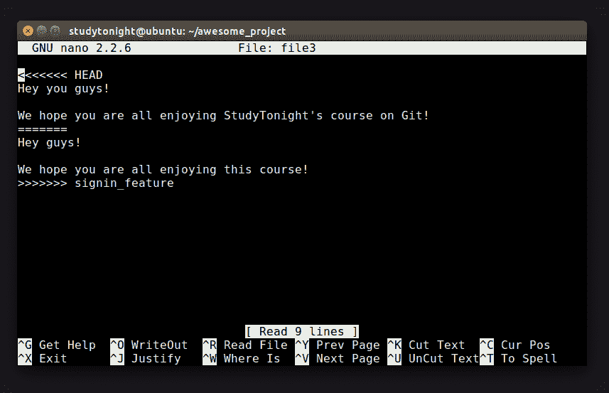
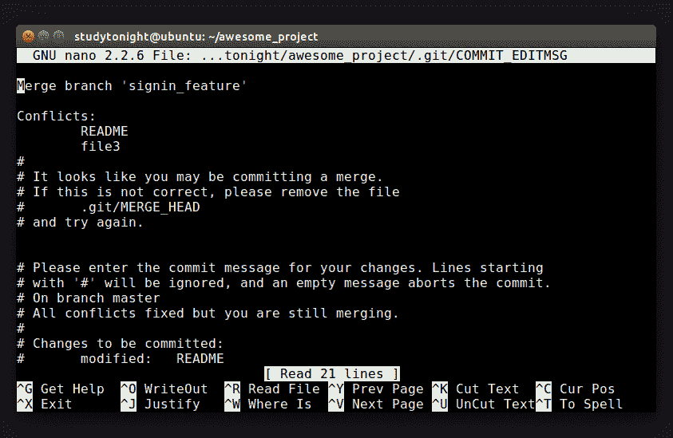

# GIT：合并冲突

> 原文：<https://www.studytonight.com/github/conflict-in-git>

我们在上一章看到的合并对 Git 来说相对容易解决。但在现实中，并不是所有的冲突都会变得容易。早些时候，我们在两个分支中对同一文件中的不同行进行了更改。你能猜到什么会构成一场激烈的冲突吗？

完全正确！在同一行，或者更确切地说，在文件的相同区域所做的更改将导致硬冲突。Git 无法确定您希望在最终项目中保留哪个版本。在一个简单的冲突中，Git 方便地将两个版本合并到文件中。

让我们继续为 Git 设置一个硬冲突。看看你在哪个部门，以确保万无一失。假设你在`signin_feature`分支。打开您的任何一个文件并进行一些更改。请记住提交此更改。

然后，签出主分支，并对同一个文件进行更改，但方式不同。

现在您已经在 master 上了，提交这个更改并尝试合并两个分支。就像上一章一样，我们看到 Git 检测到了一个合并冲突，并尝试自动启动它，但是失败了。呃-哦。

Git 检测到对同一行的更改，并且不理解您希望在最终项目中保留哪个文件。每当 Git 遇到这样的冲突时，它就把它留给用户(你！)手动解决冲突。打开冲突的文件，嗯？文件里面好像有一些奇怪的标点符号。这些不是我们写的，那是谁写的？

没错，Git 标记了冲突发生的区域。相当聪明而且乐于助人，是吧？它们被称为冲突标记。带角度的括号表示整个区域有冲突。等号行是两个版本之间的分隔符。顶部版本标记为`head`，这是最近一次提交的特殊术语。最下面的版本标着`signin_feature`，没有奖品猜猜是什么意思。

Git 给了我们全部的权力来编辑和保留我们在最终项目中想要的任何版本。既然我们已经解决了冲突，我们需要告诉 Git 已经完成了。解决所有其他冲突(如果有)。让我们将更改添加到临时区域，并运行 **$ git commit** 。

请注意，Git 知道我们正在解决一个冲突，并且已经为我们准备了一个提交消息。在那里，冲突得到了解决，两个分支机构成功合并。请记住，在这种情况下，Git 放弃了对合并解析的所有控制，它完全依赖于您来解决它。

手动处理合并可能看起来有点困难和复杂，但是它可以确保您在最终的项目中有正确的版本。所以这一切都是为了合并。

当你在个人项目上工作时，像 Git 这样的 VCS 是有用的，但是当你和其他人合作时，它们显示了它们真正的力量。当您协作时，您需要远程存储您的仓库。接下来让我们了解更多关于与远程仓库交互的信息！

* * *

* * *