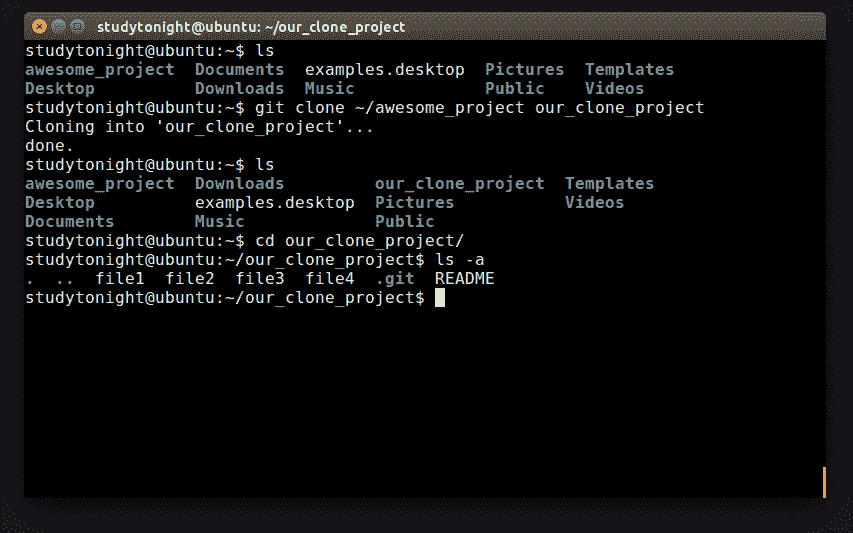
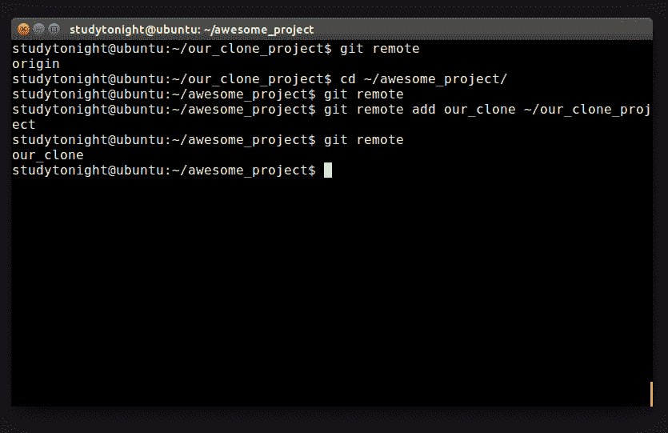

# GIT:克隆

> 原文：<https://www.studytonight.com/github/cloning-in-git>

除非您自己启动项目，否则开始基于 Git 的流程的第一步是克隆您将要使用的存储库。Git 提供了一些简单的命令来帮助我们开始。

通常，远程存储库是位于您可以通过网络访问的计算机上的存储库。对 Git 来说，远程只是意味着其他地方。但是由于你手边可能没有另一台计算机，我们将使用位于同一台计算机上但路径不同的存储库。让我们继续克隆我们当前的存储库`awesome_project`。Git 对此有一个命令，是的，你猜对了，它的 **$git 克隆**。当然你需要指定你需要克隆什么。

如果您在不同的计算机上工作，这可能是一个网络地址。如果存储库托管在某个服务器上，这将是一个网址。现在，我们可以为它提供一条通往我们的 awesome_project 存储库的路径。让我们命名我们的克隆体`our_clone_project`。

看看这个仓库，你会发现一切都如你所料。Git 已经自动为我们建立了一个出色的存储库作为远程存储库。运行 **$ git remote** ，您将看到它打印出`origin`，这是我们最初的存储库。让我们切换回原来的存储库，再次运行 **$ git remote** 。

什么都没有打印出来。如您所见，我们的原始存储库完全不受克隆的影响。这很好，因为如果有人决定查看您的代码，您不希望您的存储库改变。

但是这里的问题是，我们希望我们的两个存储库相互通信，而我们的`awesome_project`不知道我们的 _clone_project 存在。让我们通过使用 **$ git 远程**添加命令来解决这个问题。您需要为此添加提供一个名称，在这里使用`origin`没有意义。让我们称之为`our_clone`并提供我们的存储库的路径。噗！完成了！

我们现在可以创建新的分支、文件并一起工作。但是我们如何跟上两个存储库中的变化呢？在下一章中，我们将讨论在存储库之间推和拉我们的变更。

* * *

* * *