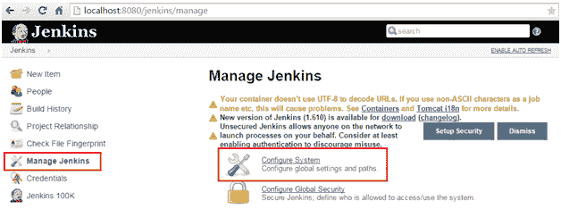
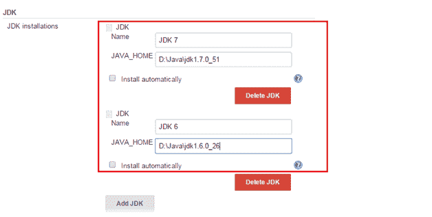
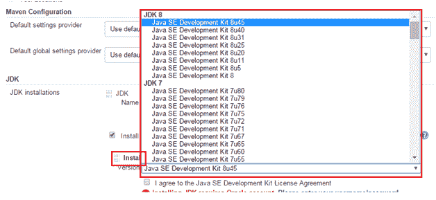

# 如何在Jenkins配置 JDK

> 原文：<https://www.studytonight.com/jenkins/configuring-jdk-in-jenkins>

在前一章中，我们学习了如何配置 Jenkins 并启动服务器，并查看其 GUI 了解其他基本配置。本章将学习如何在Jenkins配置 JDK。由于 Jenkins 通常用于构建和部署 java 应用，因此它为 Java 应用提供了出色的特性。

默认情况下，Jenkins 将使用从系统路径中找到的 java 版本。这就是Jenkins号本身运行的情况。但是，可能存在需要配置多个版本的 JDK 的情况。考虑一下，在生产系统中，应用可能在 JDK 5 上运行，在某些质量保证平台中，可能需要更高版本的 JDK，以便执行某些特定的测试，例如性能问题。

作为一种最佳实践，使用与生产环境中使用的版本接近的 java 版本来构建应用总是明智的。因为，在 JDK 5 下开发的应用可以很容易地与 JDK 6 一起运行，但反过来，失败的几率可能总是很高。

Jenkins 提供了一个很好的特性来配置多个 JVM，以克服上面提到的逆向 java 版本问题。

* * *

## 在Jenkins配置 JDK

以下是在Jenkins配置 JDK 应遵循的步骤:

1.  将 Jenkins.war 部署到 tomcat 服务器中并启动服务器。
*   From the home page, click on the link **Manage Jenkins** and click on **Configure System** as shown below :

    

    *   From the next page, click on "Add JDK". The easiest way to configure JDK is to provide a name and path of the java installation directory. (Consider the same path used for JAVA_HOME). In the below screenshot JDK 6 and JDK 7 has been configured,

    

    **NOTE :** The Jenkins will validate to check whether the installation directory exists for the specified JDK versions.*   JDK can also be installed by intimating Jenkins to do the task. The check box **install automatically** needs to be checked in this case. Jenkins will download and installs the specified version of the JDK into the tools directory of the Jenkins home directory.

    

    *   完成配置 JDK 的所有设置后，只需单击页面底部的“保存”即可保存配置。

* * *

* * *