# 在Jenkins配置构建系统

> 原文：<https://www.studytonight.com/jenkins/configuring-build-system>

要配置构建系统，需要配置 JDK、ANT/MAVEN、SCM 配置细节、自动化构建选项电子邮件通知和其他重要的东西。下面是配置时要遵循的步骤。在下面的例子中，我们认为这个项目是一个 Maven 项目。

*   Deploy and start the Jenkins server and from the home page, click on **New Item**.

    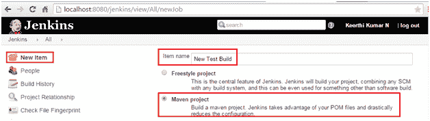

*   Then click on OK. Now a new page will be displayed where the details of JDK, ANT/Maven, SCM, automating build options, email notifications can be configured.

    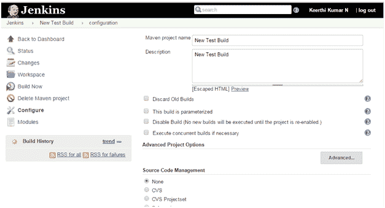

* * *

## Jenkins:配置供应链管理

为了为构建系统配置配置管理，在“源代码管理”系统下，为所需的项目选择所需的配置管理选项，并相应地提供详细信息。

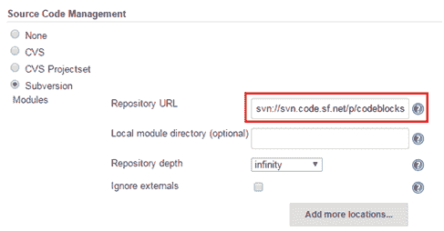

**注意:**可以在 Jenkins 中配置多个仓库 URL。

* * *

## Jenkins:配置构建触发器

Jenkins证明了触发构建的多种选择。以下都是一样的:

*   每当生成快照依赖项时生成
*   远程触发构建(例如，从脚本)
*   在其他项目完成后构建
*   定期构建(在 CRON 作业上运行)
*   轮询配置管理(在 CRON 作业上运行)

用户可以从上面的列表中配置多个选项。下面的屏幕截图显示了如何基于 CRON 作业配置构建(通过选择“定期构建”选项)

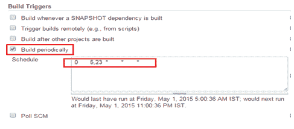

上面提到的 CRON 表达式触发器建立在每天早上 5 点和晚上 10 点，每个月重复！

* * *

## Jenkins:配置马文

对于任何要在 Jenkins 中构建的 maven 项目，入口点都是 pom.xml。配置项目构建的简单方法是指向项目的 pom.xml，如下所示:

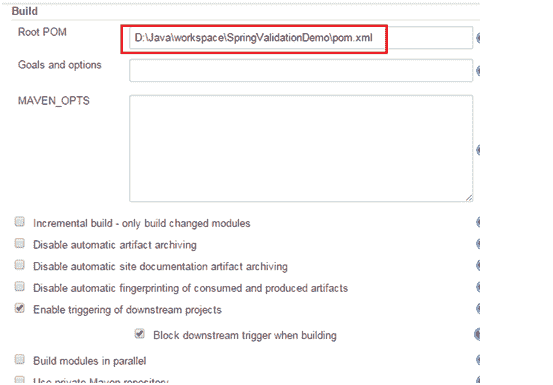

此外，还有许多其他选项也可以在这里配置，如上所示。

* * *

## Jenkins:配置 Maven 构建设置

Jenkins 提供了通过发送为每次构建运行配置的邮件来配置通知服务的功能。它可以配置如下所示:

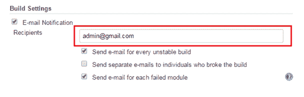

* * *

## Jenkins:配置后期构建活动

Jenkins 还提供了配置构建后需要执行的活动的功能。以下是可用的选项:

*   Aggregate downstream test results.

    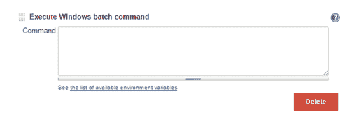

*   Archive the artifacts.

    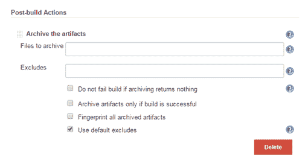

*   Build other projects.

    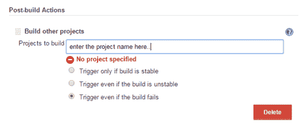

*   Deploy artifacts to maven repository.

    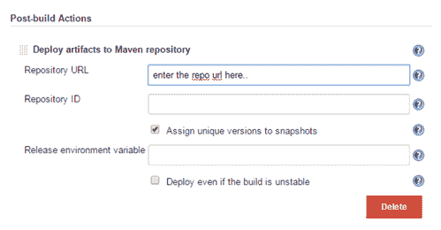

*   Record fingerprints of files to track usage.

    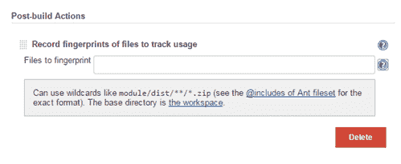

* * *

* * *