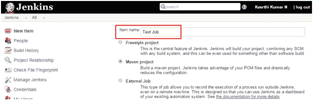
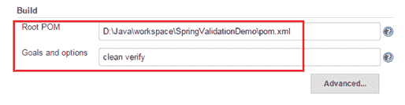
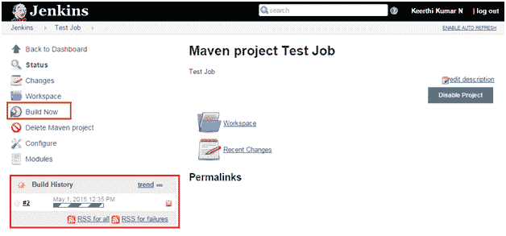

# 在 Jenkins 服务器中设置作业

> 原文：<https://www.studytonight.com/jenkins/setting-up-job>

在 Jenkins，任何项目的构建都是由 JOBs 处理的。因此，为了构建一个项目，总是需要创建一个作业。这可以很容易地完成，如下所示:

从 Jenkins 主页点击**新项目**，只需输入项目名称，选择 **Maven 项目**，点击【确定】。

在下一页的构建下，只需指向 maven 项目的 **pom.xml** ，并在**目标和选项**下指定干净验证。然后应用并保存页面。

在下一页中，将创建一个作业。只需点击**立即构建**链接，可以看到将会触发一个新的构建，如下图所示，

* * *

* * *