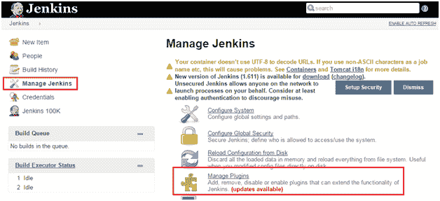
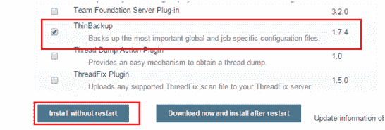
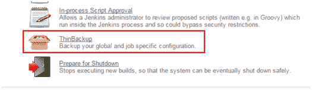
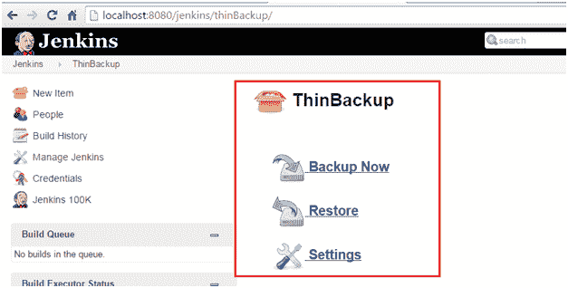
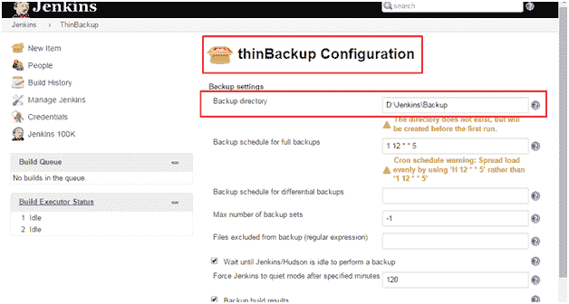

# 詹金斯服务器中的备份管理

> 原文：<https://www.studytonight.com/jenkins/backup-management>

众所周知，詹金斯总是需要一些磁盘空间来执行构建作业并将其归档。这是通过使用 JENKINS_HOME 进行配置的。只要需要，就可以配置此路径。

* * *

## 备份和恢复

在 Jenkins 中，工件的所有设置、构建日志和档案都存储在 JENKINS_HOME 目录下。简单的方法是将这个文件夹作为新的备份单独保存，每当需要使用相同的文件夹时，只需将其复制回来。

在此目录下创建的构建作业包含在 Jenkins 安装中配置的每个单独作业的所有详细信息。只要复制作业，任何作业都可以从一个安装目录移动到另一个安装目录。

此外，Jenkins 还提供了动态重命名现有作业的功能。要反映应用的更改，只需从 Jenkins 的用户界面点击**重新加载配置**。

* * *

### 存档未使用的作业

有时可能会有一些构建作业长时间不使用。在这种情况下，有一种简单的方法来归档相同的内容。只需导航到 JENKINS_HOME 目录，为需要归档的作业创建一个归档文件夹。

* * *

### 精简备份插件

由于 Jenkins 可以通过使用几个插件得到极大的扩展，因此 Jenkins 中出现了一个可以用于备份管理的插件- **ThinBackup** 插件。该插件备份作业特定的配置文件。

从詹金斯主页，点击**管理詹金斯**，在下一页点击**管理插件**。

在下一页的**可用**插件标签下，搜索/查找<u>瘦备份</u>插件。选择相同内容，点击<u>不重启安装</u>按钮。

只要重启詹金斯就能看到插件成功安装。从主页，点击**管理詹金斯**链接，在下一页，从列表中如果可以发现 ThinBackup 插件安装。只要点击相同的，下面的页面就会显示出来。

点击**设置**链接，配置备份选项。

只需根据需要提供配置细节并保存设置即可。

* * *

* * *