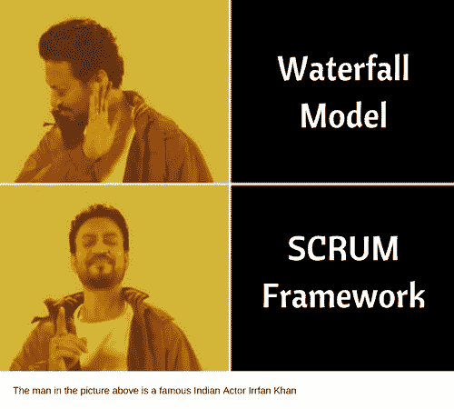

# Scrum 简介

> 原文：<https://www.studytonight.com/scrum-framework/introduction>

Scrum 是管理产品开发的几种技术之一，属于**敏捷软件开发**的大类。敏捷方法论旨在支持运行产品的*迭代*和*灵活*方法。

在多样的敏捷方法论中， **Scrum** 被很好地定义为开发软件、网站和信息技术工具等产品的组织类型。Scrum 鼓励团队在有限的时间内专注于一定数量的工作。它还允许团队建立和改进能力，以估计开发一个新功能需要花费多少努力，并且所学到的经验教训被记录在系统中。

### Scrum 起源

当时，最适合软件开发的方法是**瀑布模型**。在瀑布模型下，产品开发分阶段进行- *设计、实施和发布*。

20 世纪 90 年代末，电子媒体和互联网出现。为了支持这些，软件开发组织必须结合更多的灵活性来适应不同需求的平台的变化。此后不久，生活在台式电脑上的大型软件应用的开发让位于通过移动设备交付的更小、更灵活的应用。开发这些需要一个相同的方法。Scrum 开始以可持续和高效的方式合作，而不是等到整个周期结束。

* * *

* * *