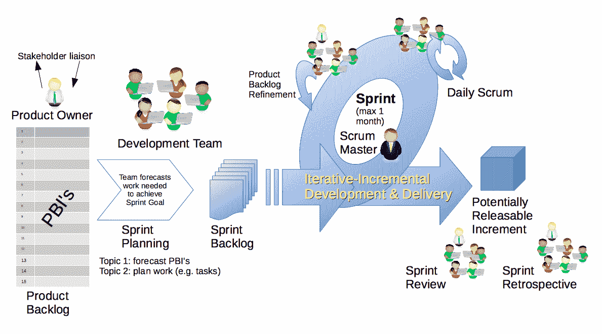

# Scrum——最热门的项目方法

> 原文：<https://www.studytonight.com/scrum-framework/scrum-methodology>

获得一门新语言的知识是获得一项新技能的最初步骤之一，语言的一致使用是团队努力合作的基础。Scrum 中定义了几个术语来清楚地理解它的含义，它们是:

**Agile:** 它是一套软件开发实践，旨在帮助开发人员协同工作，快速轻松地适应变化。

**客户:**谁雇佣了团队来创建产品。

**开发人员:**负责创建和维护产品的人员。

**产品Backlog:**一个项目的潜在特性或变化的不断发展的列表。

**产品负责人:**帮助团队定义产品的人。

**Scrum Master:** 负责维护工件和监督 Scrum 仪式的人。

**Sprint:** 固定天数，在此期间团队可以一起工作，对产品进行一系列商定的变更。

**故事:**一种清晰一致的划分、措辞和讨论团队在产品上可能需要做的工作的方式。

### 快速失败技术

Scrum 希望你失败。事实上，它以口号“**快速失败**”而闻名。不，我没开玩笑。这听起来很奇怪，但这是有很好的理由的。传统上，项目经理和开发人员会工作数月或数年才能看到结果。大多数时候，事实上 80%左右的软件和项目都失败了。那么，你可能会问，为什么他们会报名参加更多的失败？嗯，真的，他们不是。

诀窍在于关注第二个词:<u>快速</u>。*失败*是可以的，只要你从中学习，但是如果你不得不等待太久，你就不会从中学到那么多。Scrum 采纳了敏捷宣言及其关键原则，将它们归结为一个非常简单的框架，鼓励小规模的关注和快速的学习周期。

* * *

* * *