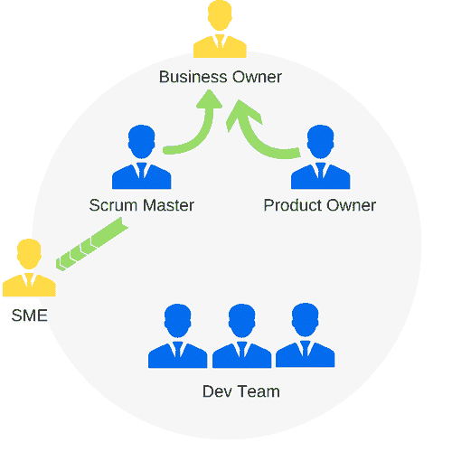

# Scrum 团队的角色

> 原文：<https://www.studytonight.com/scrum-framework/scrum-team>

Scrum 是一个轻量级的框架，它可以非常灵活、高效和强大，但是，就像一辆车一样，如果没有一个强大的引擎来推动你前进，最好的车身和设计的框架将一无所获。每个 Scrum 团队都有两个主要的重要角色:**产品所有者(PO)** 和 **Scrum 大师(SM)** 。

### 产品负责人

采购订单是团队的业务代表。他们不是兼职团队成员。他们每天都会出现，因为他们每天都在为最终产品做贡献。

他们审查团队完成的所有工作，要么接受，要么要求团队做出改变，以确保实现最高价值。早些时候，业务人员是通过很少更新的需求文档来呈现的。

在 Scrum 团队中，PO 总是对工作进行排序，并确保团队成员清楚地了解请求的细节，但这只是他们工作的一部分。他们也每天与利益相关者互动。

PO 与团队互动是不够的，他们还必须与业务环境中发生的所有变化保持一致。因此，采购订单是产品愿景的守护者。他或她定义并管理要完成的工作的积压以及这些工作项目的优先级。

### Scrum 大师

Scrum 大师是团队最显眼的代言人。Scrum Masters 重视透明度。他们会设计图表和板，与任何好奇或有兴趣知道他们如何做的人分享团队的进展。

当团队遇到困难时，他们也是第一个升级点。Scrum Master 将努力移除任何阻挡器，直到它们被清除，团队可以继续工作。当产品所有者关注需要做什么时，Scrum 大师关注团队如何工作。

还有一点，Scrum 大师还要求团队对他们对产品所有者的承诺负责。它们显示了团队绩效随时间变化的趋势，以帮助团队改进流程和实践。正如您所看到的，每个角色对于让框架正常运行都是绝对关键的。如果你缺少这些角色中的一个，Scrum 将远不如你同时拥有这两个角色的效果好。

* * *

* * *