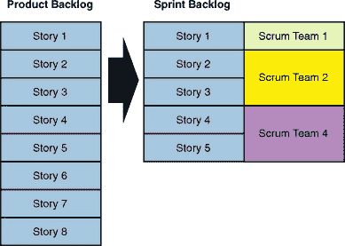

# 实际Sprint计划的 Scrum 准备

> 原文：<https://www.studytonight.com/scrum-framework/actual-sprint-planning>

充分的Sprint计划实际上是由所有团队成员完成的。团队代表在整个团队中承担工作是不合理的。

**Sprint规划要点**

*   团队代表应该准备Sprint计划。
*   如果多个 scrum 团队在处理同一个产品Backlog，他们必须聚集在一起，一起参与 sprint 计划。

使用优先化的Backlog，采购订单按顺序向团队呈现最高价值的案例。目的是团队中的每个人都充分理解故事的意图和故事的具体接受标准。对于所有的用户故事，解释 *done* 的定义也是有帮助的。

每一次Sprint都从一次**Sprint计划会议**开始，包括两次会议-**什么会议**和**如何会议**。在“什么”会议中，团队从 Scrum Backlog中挑选用户故事，他们将处理这些故事。而且，在“如何”会议中，挑选出的用户故事被进一步分解成具有设定优先级和故事点的小任务。

### 规划的前半部分-决定要实现什么

#### 回顾Sprint目标

Scrum 会议代表将展示项目的高水平愿景。产品所有者确定Sprint的目标，并证明它将如何向产品交付价值。

#### 查看产品Backlog

在Sprint计划会议之前，产品负责人将重新安排用户故事，并优先考虑这些故事。

在 Sprint 计划期间，PO 向团队呈现最高优先级的用户故事。利益相关者将对用户故事给出反馈。故事可能会根据利益相关者的反馈而改变。

### 计划的后半部分——如何完成工作

在计划的后半部分，团队决定如何完成工作。

#### 创建Backlog

PO 与团队一起回顾优先级最高的故事，并决定他们在每次Sprint中能做多少。每个人都应该在这个计划中投入自己的工作。如果有人不能提交，PO 和团队需要一起改变Sprint的形状，直到每个人都能提交。Sprint 计划是 scrum 中一个关键的协作努力。

#### 更新发布计划

一旦团队致力于用户故事，产品负责人将重新审视用户故事到 Sprints 的发布计划映射。利用当前的信息、团队在前一次Sprint中完成的故事、从当前Sprint的产品Backlog中取出的故事，产品所有者更新发布计划。

Scrum 非常重视承诺这一步。每个人的承诺对实现你的Sprint目标非常重要。从评审Sprint目标到更新发布计划，每一步都必须认真执行。

* * *

* * *