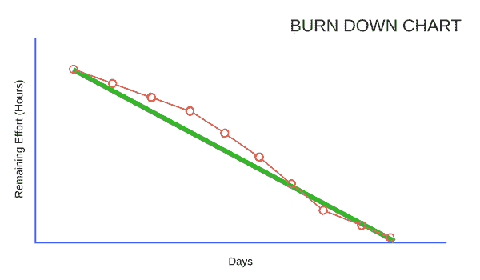

# 跟踪 Scrum 进度

> 原文：<https://www.studytonight.com/scrum-framework/track-scrum-progress>

如果项目很关键，你的涉众问团队事情进展如何是很常见的。这很好，因为人们对项目的结果很投入。但是，如果只有一些团队成员对事情的进展有全面的了解，这可能会分散团队的注意力。

Scrum 通过发布**信息辐射器**来解决这些挑战。信息辐射器是你在团队网站上发布的任何东西，它帮助每个人理解你在做什么以及进展如何。遵循这种方法让涉众知道项目中发生了什么是一个很好的实践。它显示了冲刺阶段承诺的故事、任务及其当前状态，以及已经完成的任务。

分享进度信息的另一个主要工具是冲刺**燃烧图**。团队使用这个图表来衡量他们在冲刺中的表现。在任务板告诉你任务完成情况的地方，它没有告诉你与你在冲刺阶段的情况相比如何。烧毁就可以了。

### 烧毁图表

典型的消耗图表从左上方到右下方以一条直线开始，显示冲刺的消耗率。消耗图上的线或列可以用来表示从团队在冲刺计划中承诺的工作开始，每天冲刺中实际剩余的努力点的数量。随着工作的完成，这些列应该变得更短，直到它们达到零。

下面你会发现一个非常简单的燃烧图:

这里的绿色直线代表理想的燃烧速率。冲刺的每一天，都在努力完成所有的任务。

带圆圈的橙色线条，代表实际烧毁。当实际烧损高于 Idea 烧损线时，意味着团队会错过完成日期，需要增加更多的人来增加速度。

* * *

* * *