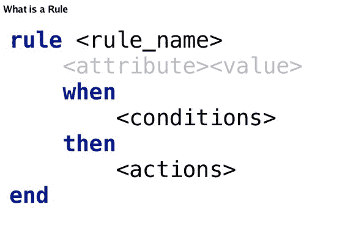
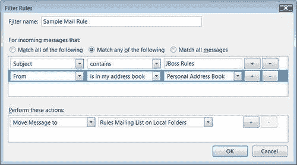

# Drools：什么是规则引擎

> 原文：<https://www.studytonight.com/drools/rule-engine>

很简单，这是一个我们可以评估业务规则的地方。没有它，我们的规则将被卡在纸上，我们没有办法把它们输入我们的系统。

A `Rule Engine`是一个软件，它有一些知识，能够利用这些知识来执行结论。**规则引擎**是可插拔的软件组件，将业务规则与应用程序代码分开。规则引擎告诉你在任何情况下该做什么，而不是怎么做。

> 用`Drools`的技术语言，我们评估**规则引擎**中的所有规则。

* * *

对于所有**微软 Outlook** 用户来说，很容易联想到一个规则。它与上面描述的相同，当主题包含 Jboss 规则时，然后采取特定的动作。因此，当满足条件的“何时”部分时，规则的“然后”部分被触发并执行。

* * *

* * *

* * *