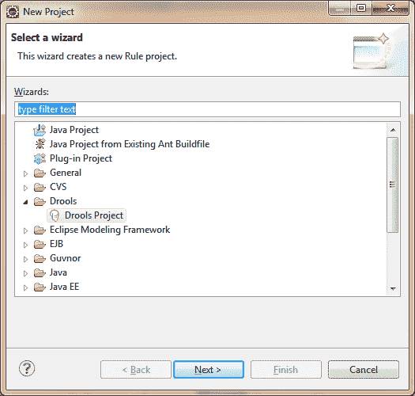
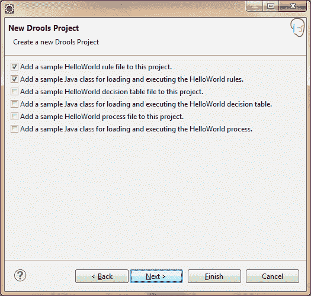
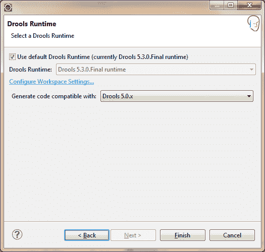
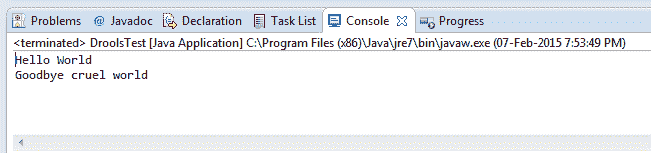

# 你好，世界口水计划

> 原文：<https://www.studytonight.com/drools/hello-world-program>

要创建一个基本的 Drools 程序，打开 **Eclipse**

转到文件 **- >** 新建 **- >** 项目

选择**流口水项目**。给这个项目起一个合适的名字。例如:**第一个口水程序**

下一个屏幕显示选择一些文件，你想要在你的第一个 drools 项目。

选择前两个文件。第一个文件是`.drl`文件(Drools Rule File)，第二个是 **java 类**，用于加载和执行 HelloWorld 规则。

点击下一步 **- >** 完成。

一旦你点击**完成**，一个 **FirstDroolsProgram** 项目将在你的工作空间中创建。

打开 java 类，然后右击并作为 java 应用程序运行。您可以看到如下输出:

我们将在下一节之后解释程序，让我们首先解释**规则引擎**的基本术语。

* * *

* * *