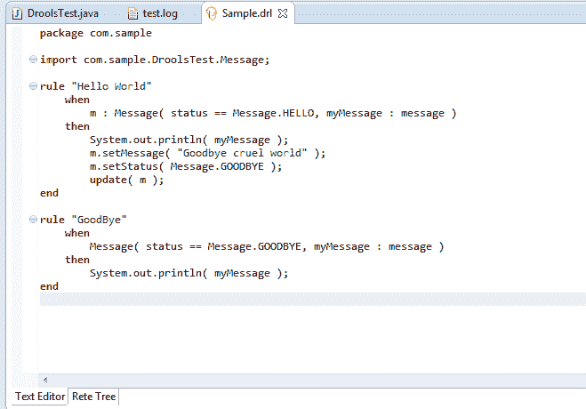
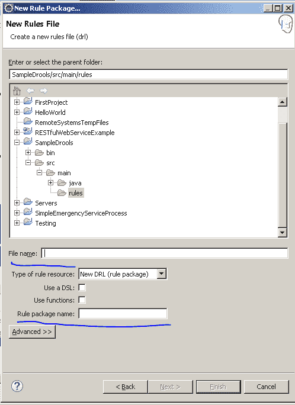

# 流口水:规则编写或语法基础

> 原文：<https://www.studytonight.com/drools/rule-syntax-basics>

如果你看到写在 **FirstDroolsProgram** 项目(Sample.drl)中的默认规则，有很多`keywords`被使用。现在让我们一个一个解释:

* * *

1.  **包:**每个规则都以包名开头。该包充当规则的命名空间。创建规则资源时，必须定义包名。包中的规则名称必须是唯一的。规则中的包类似于`Java`中的包。当您通过**新建- >规则资源- >** 创建新规则时，您需要在下面的窗口中提到规则名称和包名称。

4.  **进口对账单:**进口对账单也类似`Java`。所有的 FACTS 类和任何助手类都需要被导入，这样规则才能起作用。例如:上例中的`com.sample.DroolsTest.Message;`。

*   **规则定义:**规则定义由一些特定于`keywords`的口水组成。帖子中你已经添加了插件，你可以看到 drools 特定的红色关键词。在上面的例子中，**然后结束规则**是不同的关键词。

**规则**关键字后面必须跟一个逻辑规则名。

**时**关键字后面必须跟一些条件。

**那么**关键字必须有结果部分，如果满足当条件。

There are lot of other keywords which will be covered in further sections.
*   **全局变量:**用全局你定义**全局变量**。它们用于使应用程序对象对规则可用。通常，它们用于提供规则使用的数据或服务，尤其是规则结果中使用的应用程序服务，并从规则中返回数据，如规则结果中添加的`logs`或`values`，或用于规则与应用程序交互。

现在让我们带您浏览一下 Java 文件中用于加载 drools 和执行规则的术语。

* * *

* * *