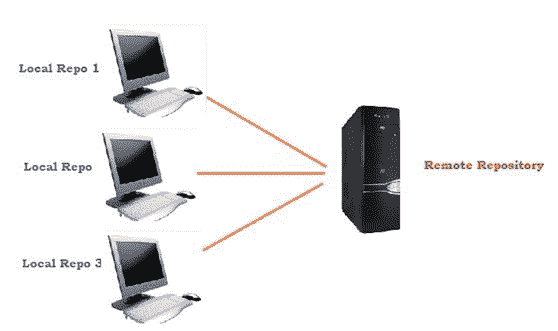

# 什么是 Maven 中的仓库？

> 原文：<https://www.studytonight.com/maven/repositories-in-maven>

对于 maven 来说，要下载构建和依赖项(jar 文件)以及其他作为任何项目的一部分配置的插件所需的工件，应该有一个放置所有这些工件的公共位置。这个公共共享区域在 maven 中被称为**仓库**。

在 maven 中，仓库分为 3 个主要类别，如下所示:

1.  本地仓库
2.  远程仓库
3.  中央仓库

* * *

## 本地仓库

驻留在我们本地机器上的仓库从远程/中央仓库下载并准备使用。可以在标签`<localRepository>`下的 maven 文件夹的 **settings.xml** 文件中配置保存/放置本地所有依赖项的文件夹。

```
<settings  
          xmlns:xsi="http://www.w3.org/2001/XMLSchema-instance" 
          xsi:schemaLocation="http://maven.apache.org/SETTINGS/1.0.0 
          http://maven.apache.org/xsd/settings-1.0.0.xsd">

      <localRepository>D:/m2repo</localRepository>
</settings> 
```

* * *

## 远程仓库

顾名思义，这个仓库位于远程服务器中，可以通过使用不同的文件传输协议(如`file://`或`http://`)来访问。远程仓库将用于下载和上传依赖项和工件。

```
<repositories>
      <repository>
         <id>remote.repository</id>
         <url>http://download.ogrname.com/maven2/</url>
      </repository>
</repositories> 
```

* * *

## 中央仓库

这是 maven 社区提供的仓库。这个仓库包含了许多 java 项目常用/必需的库。基本上，如果开发人员想要使用这个中央仓库，就需要互联网连接。但是，访问这个中央仓库不需要任何配置。

```
<repositories>
      <repository>
         <id>central.repository</id>
         <url>http://repo1.maven.org/maven2/</url>
      </repository>
</repositories> 
```

* * *

### 本地和远程/中央仓库的组织

在下图中，您可以看到本地和远程/中央仓库的组织。



* * *

### Maven 如何搜索依赖项？

基本上，当 maven 开始执行构建命令时，maven 开始搜索依赖项，如下所述:

*   它在本地仓库中扫描所有配置的依赖项。如果找到，则继续进一步执行。如果在本地仓库中找不到已配置的依赖项，它将扫描中央仓库。
*   如果在中央仓库中找到了指定的依赖项，那么这些依赖项将被下载到本地仓库中，以供将来参考和使用。如果没有找到，maven 就开始扫描远程仓库。
*   如果没有配置远程仓库，那么 maven 将抛出一个异常，说**找不到依赖关系** &停止处理。如果找到了，那么这些依赖项将被下载到本地仓库中，以供将来参考和使用。

* * *