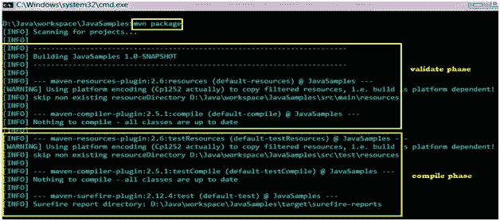
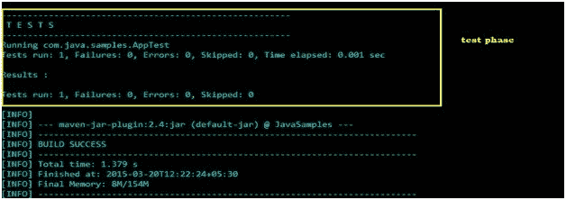
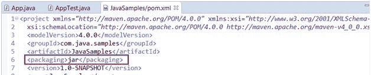
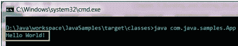
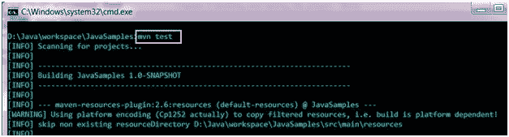
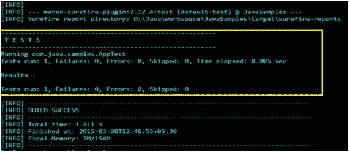

# 构建并测试你的第一个 Maven 项目

> 原文：<https://www.studytonight.com/maven/build-and-test-maven-project>

在前面的教程中，我们已经看到了如何使用 maven 原型创建示例 maven 项目，并了解了文件夹结构是如何组织的。现在，我们将看到如何构建一个项目并测试编写的代码。

* * *

## 构建一个 Maven 项目

一旦在项目中完成了编码，就需要编译、构建项目，并使其为部署做好准备。

为此，请打开命令提示符并导航到包含 pom.xml 文件的根项目文件夹。例如 D:\ Java \ workspace \ JavaSimples。现在，输入命令`mvn package`并按回车键。该命令将调用 maven 包阶段。

正如这里所解释的，每当 maven 阶段被调用时，它都会按顺序执行直到被调用的阶段。因此，在这种情况下，将执行上述包–**验证**、**编译**和**测试**阶段。

当运行 mvn package 命令时，maven 将验证并编译源代码，执行 junit 测试用例，并根据 pom.xml 文件中标签`<packaging>`中给出的指令对其进行打包/捆绑。如果包装被指定为**罐子**，那么将创建一个带有该包装的罐子。

*   打包的 jar 文件将在项目的目标目录下可用。即**D:\ Java \ workspace \ JavaSamples \ target**。
*   所有的测试报告(junit 测试细节)都可以在文件夹**D:\ Java \ workspace \ JavaSamples \ target \ surefire-reports**中找到

要运行 App.test java，请打开命令提示符并导航到文件夹 D:\ Java \ workspace \ JavaSamples \ target \ class，然后输入命令 **java com.java.samples.App**

要运行测试类(junits)，打开命令提示符，从项目的根文件夹中，执行命令 **mvn 测试**

* * *