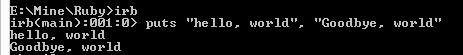
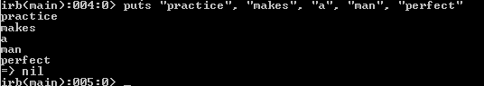
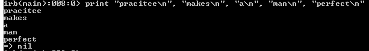

# 使用`print()`和`puts()`显示数据

> 原文：<https://www.studytonight.com/ruby/displaying-data-in-ruby>

现在，我们将学习如何在屏幕上显示数据。为此，Ruby 提供了两个功能:

*   `puts()`
*   `print()`

* * *

## Ruby:`puts()`法

`puts`在数据末尾自动添加新行。

```rb
puts ("hello, world")
puts "hello, world"
```

您可以使用这两种方式来显示数据。要在一个 puts 语句中打印多个字符串，请使用下面的方法。它将在每个字符串的末尾添加一个换行符。

```rb
puts "hello, world", "Goodbye, world"
```



也试试下面的例子:

```rb
puts "practice", "makes", "a", "man", "perfect"
```



* * *

## Ruby:`print()`法

`print`结尾不加新行。

```rb
print "hello, world"
```

如果你想用打印方式在数据的末尾包含新行，那么你必须为新行包含特殊字符`\n`。

```rb
print "hello, world\n"
print "practice\n", "makes\n", "a\n", "man\n", "perfect\n"
```



您也可以使用这些函数显示数字数据。

```rb
puts(1)
print(1)
```

您也可以评估表达式并显示结果。

```rb
puts (2+2)
print(2+2)
```


* * *

* * *