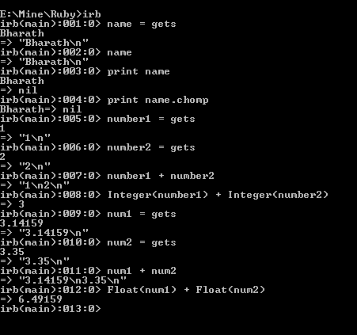

# 在 Ruby 中使用`gets()`从用户获取数据

> 原文：<https://www.studytonight.com/ruby/getting-user-input-ruby>

为了使程序与用户交互，程序通常需要用户的输入。为此，我们可以使用`gets`方法。`gets`函数以字符串格式从键盘获取输入，并将值存储在变量中。

```
name = gets
```

该语句从用户处获取字符串输入，并将其存储在名为 name 的变量中。

它还在用户输入的输入结束时追加一个`\n`新行字符。



因此，当您键入变量名时，它会显示存储在其中的内容。当您使用`print`功能显示时，它会显示用户输入的文本以及新的一行。要删除换行符，可以使用名为`chomp`的函数。以下语句从用户输入的内容中删除换行符。

```
print name.chomp
```

* * *

以下代码将两个整数与用户提供的数字相加:

```
number1 = gets
number2 = gets
(Integer)number1 + Integer(number2)

```

`Integer()`部分代码现在对你来说看起来很棘手。

如前所述，`gets`方法获取字符串格式的输入。因此，在对数据执行算术运算之前，需要转换为整数。这可以使用`Integer()`功能来完成。

如果不将这些变量转换为整数，它将连接两个字符串，而不是执行算术加法。你还记得我们在第 1 章前面看到的连接两个字符串吗？同样，要添加两个十进制数，请查看以下代码:

```
num1 = gets
num2 = gets
float(num1) + float(num2)

```

**注:** `float()`方法用于将数据转换为十进制格式。如果转换没有完成，它只是像前面所说的那样执行串联操作。

* * *

* * *