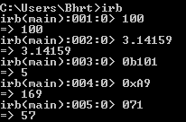
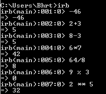
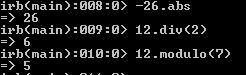
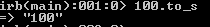
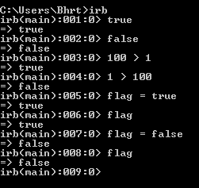
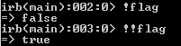
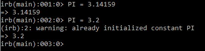

# Ruby 中的变量和数据类型

> 原文：<https://www.studytonight.com/ruby/variables-in-ruby>

在本课中，我们将看到不同类型的变量和常数。虽然有几种类型的变量，如类变量和全局变量，但我们将在本课中了解局部变量。要在 ruby 中创建一个变量，我们只需使用赋值语句提供一个名称和值。

```
number = 100
```

* * *

## Ruby:命名变量的规则

1.  Must begin with lowercase letters or underscore like : `number`, `_name`. Underscore come in handy when we create a compound variable using **Snake Case** like,

    ```
    first_name = "Bharath"
    ```

    Another way to write compound variable or multiword variable is **Camel Case**.

    ```
    lastName = "Kumar"
    ```

    [Ruby 风格指南](https://github.com/bbatsov/ruby-style-guide)向 Ruby 开发人员推荐了一致的约定和最佳实践。

2.  后跟下划线或小写字母变量的下一个字符可以是数字或其他字母，但不能是符号。

    ```
    _123, rate1  *//valid* 
    #abc, n*ame  *//invalid variable names.*

    ```

3.  名称应该与任何保留关键字相匹配。我们将在[保留关键词一课](reserved-keywords-in-ruby)中查看 ruby 中的保留关键词。

4.  **全局变量**是通过在变量名前放一个美元符号`$`来创建的。《出埃及记》 `$salary = 10000`。工资是一个全局变量，可以在整个项目中看到。

* * *

## 红宝石:数字数据类型

在本节中，我们将使用数字数据类型。Ruby 支持主要的数字系统，如整数、浮点数。允许`Binary`、`Octal`、`Hexadecimal`等不同的碱基。



要用二进制写，我们使用`0b`和相应的数字。例如，5 在二进制中可以写成 101。同样，用十六进制`0x`表示数字，八进制 **0** 单独使用。负数通过在数字前使用一元运算符- **(负)**来表示。

Ruby 支持加、减、乘、除、模、幂等不同的算术运算。



在上图中，您可以看到执行的算术运算。

*   `9 % 3`语句提供 9 除以 3 的余数。在这种情况下，结果将为 0。
*   `2 ** 5`语句将 2 的幂提高到 5。所以，结果会是 2 * 2 * 2 * 2 * 2，等于 32。

我们将在后续课程中详细学习运算符。

* * *

## 红宝石:ABS 法

`abs`是用来求一个数的绝对值的方法。例如， **-26.abs** 给出的值是 26。其他一些方法是 **div** 和**模**。



您也可以将数字转换为字符串。例如，要将 100 转换为字符串:

`100.to_s`



* * *

## 红宝石:布尔数据类型

布尔型变量可以保存两个值**真**或**假**。但是在 ruby 中，它也可以保存布尔变量中的第三种类型的值，称为 **nil** 。但是在大多数情况下，我们只使用**真**和**假**值。所以，让我们专注于这两个。

布尔数据类型用于比较、循环和决策语句。 **100 > 1** 返回**真**。因为 100 大于 1。同样， **1** > **100** 返回假。

您也可以为变量指定布尔值。

`flag = true`

赋值后，变量**标志**包含布尔值**真**。



Not 运算符`(!)`否定布尔值。例如，如果`flag`变量包含值**真**。然后标志变量的否定给出了值**假**。



也可以对变量进行双反。但不止一次否定往往会令人困惑。因此，当你需要的时候，最好坚持使用单一否定。

* * *

## 红宝石:常数

`Constants`是在整个程序中保持相同值的变量。Ruby 是一种典型的语言，您可以在其中重新分配常量。按照惯例，ruby 中的所有常量都是大写的字符，以便于区分。



注意，它确实改变了常量的值，但是它给出了一个警告，说**“PI 已经是初始化常量了”**。

所以，只要注意你可以在 ruby 中定义常数，你也可以改变它的值，这意味着你想知道它们不应该被称为`constants`。正如我们已经说过的，Ruby 是一种典型的语言。

* * *