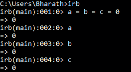
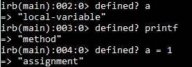
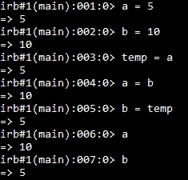
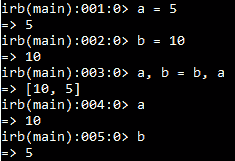

# 红宝石杂项表达式

> 原文：<https://www.studytonight.com/ruby/miscellaneous-expressions-in-ruby>

在本教程中，我们将学习链式赋值、定义运算符和并行赋值。

* * *

## 鲁比:链接作业

通常，在程序中，您希望用相同的值初始化一组变量，通常为 0。

不过，你可以这样做

```
a = 0
b = 0
c = 0
```

但是，程序员使用的还有一种叫做`chaining assignments`的方式。

```
a = b = c= 0
```

现在这三个变量都有相同的值。



可以看到变量 **a** 、 **b** &、 **c** 具有相同的值 0。

## 红宝石::`defined`运算符

这是 ruby 的一个有趣的特性。在表达式中使用它，我们可以确定它是什么类型的标识符。我们已经将变量**定义为**。我们现在可以使用定义的运算符来识别什么是 **a** ？



因为变量 a 是在本地声明的，所以它作为`local-variable`返回。同样，它返回`method`表示**打印**和`assignment`表示表达式 **a = 1** 。

## 鲁比:并行分配

考虑变量 a 包含 5，b 包含 10，现在我们必须交换变量的值。

它是由，

```
a = 5
b = 10
temp = a
a = b
b = temp
```



但是有一种有效的方法叫做`parallel assignment`。这可以通过 **a，b = b，a** 来完成。安静简单。正确



最初 **a** 和 **b** 的值为 **5** 和 **10** ，并行赋值后 **a** 和 **b** 的值为`swapped`。

* * *