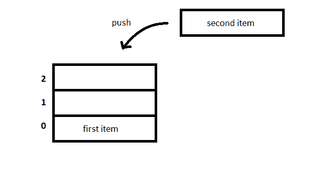
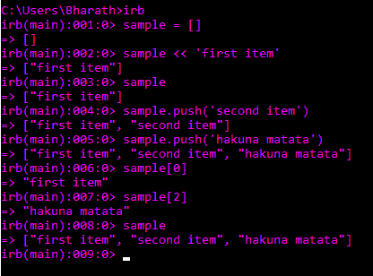
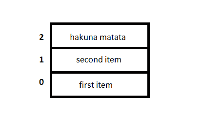
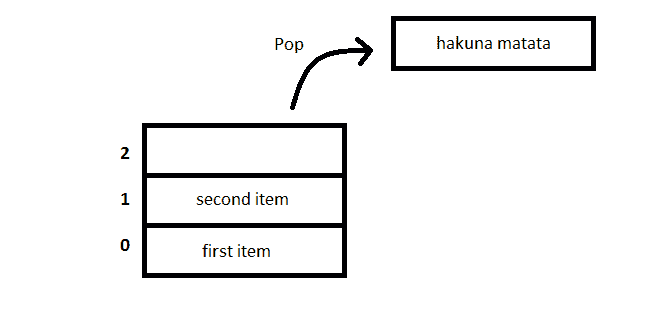
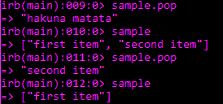

# Ruby 中的`push`和`pop`方法

> 原文：<https://www.studytonight.com/ruby/push-and-pop-in-ruby>

在这一课中，我们将学习更多关于数组的知识，更多的方法使`add`和`remove`元素往返于数组。打开交互式 ruby Shell 并键入:

```
sample = [ ]
```

这将创建一个空数组，其中没有元素。现在，我们将向这个名为**样本**的空数组中添加元素。您可以将元素推入数组。你可以用几种方法做到这一点。

```
sample << '*first item*'
```

该语句将字符串**“第一项”**推入数组。

* * *

## 鲁比:推送操作

将项目添加或推入数组的另一种方法是使用`push()`方法。

```
sample.push("*second item*")
```





现在，你可以看到数组中有三个名为`sample`的项目。



* * *

## 露比:流行操作

要从数组中移除元素，我们使用`pop()`方法。

```
sample.pop
```

要移除元素，不需要指定参数。它会移除最近插入的项目，无论它是什么。



**弹出操作**



如您所见，`pop`操作移除了最近插入的项目**哈库纳马塔**，然后是**第二个项目**。现在，数组只包含一项。这些操作允许数组用作 **STACK** 数据结构。

记住，

1.  `push` -将项目或元素插入数组。
2.  `pop` -从数组中移除项目或元素。

* * *